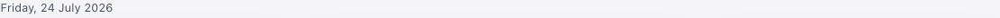
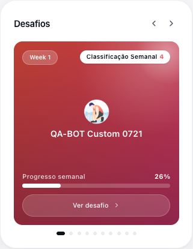
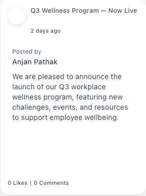
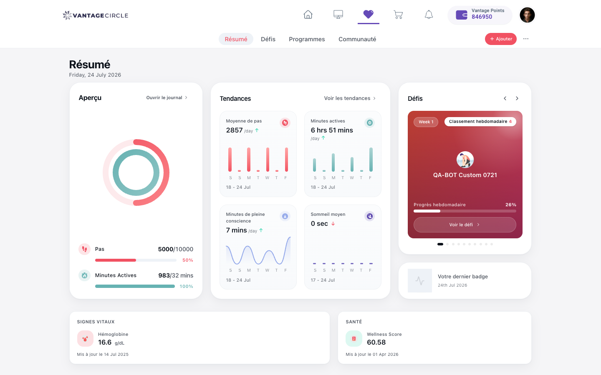

# Vantage Fit Web — Localization Bug Report (consolidated)

**Surface:** Employee Vantage Fit web — `app.vantagecircle.co.in/ng/fit/summary` (heart icon)
**Account / tenant:** `anjan.pathak@… (UAT test account)` — UAT
**Languages tested:** German (de), French (fr), Spanish (es), Portuguese (pt) + English baseline
**Date:** 2026-07-24 · **Module covered so far:** Summary
**How to reproduce any bug below:** Profile avatar → View Profile → My Info → **Edit Profile → Language → Save** (forces logout → re-login via `api.vantagecircle.co.in`) → open `/ng/fit/summary`.
**Screenshots:** `../evidence/summary_de.png`, `summary_fr.png`, `summary_es.png`, `summary_pt.png`, baseline `fit_summary_landing.png`.

---

## 🔧 Assign to FRONTEND developer (top priority first)

| # | Priority | Bug title |
|---|---|---|
| B1 | **P2** | Dates show in English format/text in every language |
| B2 | **P2** | Language-change alert prints a literal `{language}` placeholder (de/fr/es) |
| B3 | **P2** | "Challenges" navigation tab not translated in German |
| B4 | **P2** | "Week 1" (challenge week label) not translated in any language |
| B5 | **P2** | Highlights "Posted by / Likes / Comments / 2 days ago" not translated |
| B6 | P3 | Measurement units (mins / sec / hrs / /day) stay English |
| B7 | P3 | Trend-chart weekday axis "S M T W T F" not localized |
| B8 | P3 | "Active Minutes" label capitalized inconsistently (fr & pt) |
| B9 | P4 | "Wellness Score" stays English (confirm if intentional brand term) |
| B10 | P4 | i18n JSON asset requests return the SPA HTML shell (infra) |
| B11 | **P2** | Language preference not persisted — reverts to English after session expiry/re-login (FE/BE TBD) |
| B12 | **P2** | Formal/informal register mixing — **3 languages confirmed** (de "Ihr", es "Su/sus/Camine", fr "Votre/vos/Faites") on the same 3 positions; pt checked, doesn't clearly apply (no competing informal form found) |
| B13 | P3 | "Written By" label not translated in bite-size content detail (Programs) — confirmed de + es |
| B15 | P3 | CTA button overlaps body text in bite-size content intro screen (Programs) — confirmed de + es, language-independent |
| B16 | **P2** | Community module chrome 0% localized; nav/footer regress to English while on this route — confirmed de + es |
| B17 | **P2** | "You are currently in a caloric deficit" sentence not translated (Diary, de) |
| B18 | P3 | "mile" unit word not translated in Diary's Distance section (de) |
| B19 | **P2** | Trends (`/activity-stats`) page mostly unlocalized; **es also drags nav down** (de doesn't) — inconsistent even within itself |
| B20 | **P2** | Diary chrome + nav regress to English in Spanish — Diary was the best-localized screen in German |
| B21 | P3 | Spanish "challenge" rendered two ways: nav "Retos" vs body "Desafío" (parallel to B3, different mechanism) |
| B22 | P3 | Trends metric-switcher selection pill overlaps neighboring tab's text — worse in Spanish (user-found) |
| B23 | **P2** | Programs content thumbnails render as solid black boxes — malformed CDN URLs (23 double-`.png.png`, broken fallback) |
| B24 | P3 | Offerings tab intermittently shows "Unable to load offerings right now" — transient 502 on marketplace/categories |
| B25 | **P2** | Effective/runtime language desyncs from `<html lang>` + saved preference mid-session (no re-login) — generalizes B14/B16/B19/B20 |
| B26 | P3 | Adherence-activity answer option "Yes" not translated (backend `configuration` API data) — should be "Sí" |
| B27 | **P2** | Water weekly-task sentence garbled: untranslated "fl oz", nonsensical "fl oz vasos", and "1 días" pluralization error |
| B28 | P3 | Log Water "1 glass = 250 ml" label doesn't convert when switching to fl oz (value + slider do convert) |
| B29 | P3 | Challenge card clips 36px in its fixed-width box — every width, **every language incl. English** (not a loc defect) |
| B30 | P3 | Log Water modal has no dialog semantics (`role`/`aria-modal`/name) and does not move focus |
| B31 | **P2** | Log Water submit with no amount closes the dialog with **zero feedback** (toast absence confirmed) |
| B32 | P3 | Past challenge shows an end date **before** its start date (`07 Oct 2025 - 15 Sep 2025`) [FE-BE TBD] |
| B33 | **P1** | **Fit i18n endpoint serves the SPA HTML shell, not JSON — Fit localization broken in EVERY language. Supersedes B10; likely explains B3/B16/B19/B20/B25** |
| B34 | P4 | Language dropdown option names all English regardless of UI language (endonyms?) — judgment, independent of B33 |
| B35 | **P2** | **Arabic/RTL: numeric, unit and date runs render in REVERSED visual order (no bidi isolation) — DOM is correct, rendering is wrong; invisible to text extraction** |

## 🗄️ Assign to BACKEND developer

**None identified in the Summary module.** All backend/data-driven strings behaved correctly across
de/fr/es/pt (they stayed as authored, which is expected): the challenge name "QA-BOT Custom 0721", the
Highlights post title "Q3 Wellness Program — Now Live", and the user name "Anjan Pathak". No server-rendered
string was found mis-localized here. (Re-evaluate per module — backend candidates may appear in Challenges/
Reports-type screens.)

**Programs (2026-07-28):** **B14** — "Alle anzeigen" content grid returns empty (`GET /content/category/20`)
while the same category has content via a sibling endpoint (`POST /content/byCategoryName`) — likely a
locale-handling gap on the paginated endpoint. P2, FE/BE TBD pending an English-baseline comparison.

**Programs (2026-07-28, missed on first pass — found via a second review prompted by the user):** **B23** —
28 unique content-image URLs 404 on a single page load (23 double-extensioned `.png.png`, 1 with a doubled
path segment, 4 genuinely missing named assets, plus the `default.png` fallback itself 404ing) — renders as
solid black boxes across nearly every Library and Offerings thumbnail. P2, locale-independent. **B24** — an
intermittent 502 on `/marketplace/categories` occasionally shows "Unable to load offerings right now"; a
manual retry recovers it. P3, backend reliability note.

---

# Detailed bugs (top priority first)

## B1 — [P2] Dates display in English format/text in every language
**Type:** Localization / Copy · **Layer:** Frontend
**Where:** Summary — header date, badge date, trend ranges, "Updated on" dates.

**Description & proof:** In de/fr/es/pt the "Updated on…" *prefix* is translated but the date itself is not,
and the main dates stay fully English. Captured on fresh loads:
- Header: **"Friday, 24 July 2026"** — identical in all 4 languages (should be e.g. de "Freitag, 24. Juli 2026").
- Badge: **"24th Jul 2026"** (English ordinal + month) in all 4.
- Trend ranges: **"18 - 24 Jul"**, **"17 - 24 Jul"** in all 4.
- de "Aktualisiert am **14 Jul 2025**", fr "Mis à jour le **14 Jul 2025**", es "Actualizado el **14 Jul 2025**",
  pt "Atualizado em **14 Jul 2025**" — prefix localized, date English.

**Expected:** locale-formatted dates with translated weekday/month names.
**Screenshot (crop):** `../evidence/bug_B1_date_header_pt.png` · full page `../evidence/summary_de.png`.

---

## B2 — [P2] Language-change alert prints literal `{language}` placeholder
**Type:** Localization / Copy · **Layer:** Frontend
**Where:** My Profile → Edit Profile → change Language → Save (confirmation alert).

**Description & proof:** The confirmation alert's translated strings contain an un-interpolated `{language}`
token. Exact captured alert text:
- **de:** "Sie haben Ihre Sprache in **{language}** geändert. Bitte melden Sie sich erneut an, um auf die Website zuzugreifen."
- **fr:** "Vous avez changé votre langue pour **{language}**. Veuillez vous reconnecter pour accéder au site."
- **es:** "Has cambiado tu idioma a **{language}**. Inicia sesión de nuevo para acceder al sitio."
- **pt:** "Você alterou seu idioma para **{language}**. Faça login novamente para acessar o site."
- **en (correct):** "You have changed your language to **German**. Please login again to access the site."
- → confirmed broken in **all four** non-English locales (de/fr/es/pt); only English interpolates.

**Expected:** the chosen language name interpolated, as English already does.
**Root cause (likely):** the translated strings use a placeholder token the interpolation doesn't replace.
**Screenshot:** none — this is a native browser alert (text captured verbatim above as proof).

---

## B3 — [P2] "Challenges" tab not translated in German
**Type:** Localization · **Layer:** Frontend
**Where:** Summary — top navigation tabs.

**Description & proof:** The 4 tabs translate in fr/es/pt but German leaves "Challenges" in English:
| Tab | de | fr | es | pt |
|---|---|---|---|---|
| Challenges | **Challenges** ❌ | Défis ✅ | Retos ✅ | Desafios ✅ |

(Summary/Programs/Community translate fine in all 4.) → German dictionary is missing this tab's entry.
**Expected:** de "Herausforderungen" (or agreed term).
**Screenshot:** `../evidence/summary_de.png` (tab bar shows "Challenges") vs `../evidence/summary_fr.png` ("Défis").

---

## B4 — [P2] "Week 1" not translated in any language
**Type:** Localization · **Layer:** Frontend
**Where:** Summary → Challenges card (week badge).

**Description & proof:** Renders literal **"Week 1"** in de/fr/es/pt (captured in all four string dumps).
**Expected:** de "Woche 1", fr "Semaine 1", es/pt "Semana 1".
**Screenshot (crop):** `../evidence/bug_B4_week1_pt.png` (Challenges card — badge still reads "Week 1" in Portuguese).

---

## B5 — [P2] Highlights social strings not translated
**Type:** Localization · **Layer:** Frontend
**Where:** Summary → Highlights (community post) card.

**Description & proof:** In all 4 languages the card shows English: **"Posted by"**, **"0 Likes"**,
**"0 Comments"**, and relative time **"2 days ago"**. (The post *title* "Q3 Wellness Program — Now Live" is
user/backend data and correctly stays as authored — not a bug.)
**Expected:** translated labels + localized relative time (e.g. de "vor 2 Tagen", "Gepostet von", "Kommentare").
**Screenshot (crop):** `../evidence/bug_B5_highlights_social_pt.png` (post shows "2 days ago / Posted by / Likes / Comments" in English while in Portuguese).

---

## B6 — [P3] Measurement units stay English
**Type:** Localization · **Layer:** Frontend
**Where:** Summary → Snapshot & Trends cards.

**Description & proof:** Unit abbreviations unchanged in all 4: **"6 hrs 51 mins"**, **"7 mins"**, **"0 sec"**,
**"2857 /day"**, **"983/32 mins"**. Units appear concatenated as hardcoded English.
**Expected:** locale-appropriate units.
**Screenshot (crop):** `../evidence/bug_B6_B7_units_axis_pt.png` (Trends card in Portuguese — "6 hrs 51 mins", "/day", and the "S M T W T F" axis all English). Same crop evidences **B7**.

---

## B7 — [P3] Trend-chart weekday axis not localized
**Type:** Localization · **Layer:** Frontend
**Where:** Summary → Trends charts (x-axis).

**Description & proof:** Axis initials render **"S M T W T F"** (English) in all 4 languages.
**Expected:** localized weekday initials (e.g. de "M D M D F S S").
**Screenshot (crop):** `../evidence/bug_B6_B7_units_axis_pt.png` (weekday letters "S M T W T F" under the Trends chart).

---

## B8 — [P3] "Active Minutes" capitalized inconsistently (fr & pt)
**Type:** Localization / UI consistency · **Layer:** Frontend
**Where:** Summary — Snapshot card vs Trends card (same metric).

**Description & proof:** The same label uses different casing in two places:
- fr: **"Minutes Actives"** (Snapshot) vs **"Minutes actives"** (Trends)
- pt: **"Minutos Ativos"** (Snapshot) vs **"Minutos ativos"** (Trends)
**Expected:** one consistent capitalization.
**Screenshot:** `../evidence/summary_fr.png` (compare Snapshot vs Trends card labels).

---

## B9 — [P4] "Wellness Score" stays English (judgment call)
**Type:** Localization / Copy · **Layer:** Frontend
**Where:** Summary → Health card.

**Description & proof:** "Wellness Score" is unchanged in all 4 languages. May be an intentional brand/product
term (like "Vantage Fit"). **Needs product confirmation** whether it should localize.
**Screenshot:** `../evidence/summary_es.png` (Health card: "Wellness Score 60.58").

---

## B10 — [P4] i18n JSON asset requests return the SPA HTML shell
**Type:** Infrastructure · **Layer:** Frontend / build config
**Where:** network — `/ng/assets/i18n/fit/{en,fr,es,pt,pt-BR,pt-PT,de}.json`.

**Description & proof:** The app requests those 7 locale files, but each responds with
`content-type: text/html` (the SPA `index.html`), i.e. `<!DOCTYPE html> <html lang="en" …`, not JSON.
Translations still render (strings are served/bundled elsewhere), so it is **not user-visible** — but the
requests are dead/HTML-fallback and suggest a misconfigured asset path worth cleaning up.
**Proof:** fetch of `/ng/assets/i18n/fit/en.json` → 200, `content-type: text/html`, body begins
`"<!DOCTYPE html> <html lang=\"en\" data-beasties-container>"`.
**Screenshot:** n/a (network/console evidence; recorded in `Execution_Status.md`).

---

## B11 — [P2] Language preference not persisted across sessions
**Type:** Localization / Functional · **Layer:** Frontend / Backend (TBD)
**Where:** Profile language ↔ Fit web, after a session expiry + re-login.

**Description & proof:** A saved language reverts to English on the next login.
- Saved profile Language = German earlier; Fit web rendered German that session (verified, `challenges_de.png`).
- After the browser session expired and I re-logged in, the Fit web loaded in **English** (`html lang="en"`,
  `programs_en_baseline.png`), and the profile "Edit Profile → Language" select read back **"English"**.
- Re-selecting German + re-login restored German for that session only.

**Expected:** a saved language preference persists across logout/login until changed.
**Note/Doubt:** could be (a) language stored session-only, not persisted to the account, or (b) default-to-
  English on session bootstrap. Reproduced once via natural session expiry. Needs dev confirmation of
  intended persistence and whether it is FE (session/local) or BE (account preference). Discovered during
  the Programs pass. [FE/BE — TBD]
**Screenshot:** `../evidence/programs_en_baseline.png` (loaded EN after re-login).

---

## B12 — [P2] Formal/informal register mixing (cross-module, cross-language)
**Type:** Localization / Copy (tone consistency) · **Layer:** Frontend
**Where:** Cross-module — Summary, Programs (Offerings sub-tab + bite-size content body), Community (badge
widget), Challenges (weekly task instructions) — confirmed in **German, Spanish, and French**.

**Description & proof:** German (*Sie/Ihr* vs *du/dein*) and Spanish (*usted/su* vs *tú*) both have two
politeness registers, and the Fit web mixes them in both languages, reading as inconsistent voice.
- **German — informal (du)** dominates: "**Sieh**, was in **deiner** Community passiert" (Summary), "Scanne,
  um **dich** auf **deinem** Smartphone anzumelden" (footer), "Brauchst **du** Hilfe…" (footer), "**Tritt**
  gegen Kollegen an und **verfolge deine** Aufgaben." (Challenges), "Erfasse **deinen** Schlaf…" (Diary).
- **German — formal (Ihr/Ihre/Ihren)** on 3 surfaces: "**Ihr** neuestes Abzeichen" (Summary/Community badge
  widget), "Um **Ihre** umfassenden Wellness-Bedürfnisse zu erfüllen" (Programs → Offerings), "**Ihren**
  Körper mit den richtigen Nährstoffen…" (Programs → bite-size content **body copy**).
- **Spanish — informal (tú)** dominates: "Escanea para iniciar sesión en **tu** teléfono" (footer),
  "¿Necesitas ayuda…?" (footer, tú-conjugated verb), "Compite con **tus** compañeros…" (Challenges subtitle).
- **Spanish — formal (su/sus)** on the SAME 2 surfaces as German: "**Su** última insignia" (Summary/Community
  badge widget — exact structural counterpart of "Ihr neuestes Abzeichen"), "Para cuidar de **sus**
  necesidades de bienestar completa" (Programs → Offerings — exact structural counterpart of "Ihre
  umfassenden…").
→ The register split isn't a German-specific translation slip — it recurs on the **identical two strings**
in Spanish, meaning the source content/copy itself (or a shared template both locales translate literally)
carries the inconsistency, not a one-off per-language mistake.
- **Spanish surface 3 (2026-07-28 deep-dive):** Challenges' weekly task instructions use **formal ("usted")
  imperatives** — "**Camine** 5.000+ pasos…", "**Beba** al menos…", "**Registre** su entrenamiento…" (informal
  equivalents would be "Camina", "Bebe", "Registra") — while the SAME app's footer and subtitles use informal
  "tú" throughout, showing the split also reaches backend-templated task copy, not just static UI strings.
- **French — confirmed on the SAME 3 structural positions (2026-07-28):** "**Votre** dernier badge"
  (Summary/Community badge widget), "Pour répondre à l'ensemble de **vos** besoins en matière de bien-être."
  (Programs → Offerings subtitle), and the challenge task instructions "**Faites** 5 000+ pas…", "**Buvez**
  au moins…", "**Enregistrez** votre entraînement…" (formal "vous" imperatives; informal "tu" equivalents
  would be "Fais", "Bois", "Enregistre"). This is the SAME 3 positions as German/Spanish, in a 3rd language —
  very strong confirmation of a shared-source-string origin. **Caveat:** an informal French contrast
  (equivalent to footer "tú"/"du") was not independently reconfirmed this pass, because the session was in
  the B25 English-fallback state for most French FE chrome at the time — the structural match to the
  already-proven 2-language pattern is the evidence here, not a fresh French-only mixing observation.
- **Portuguese — checked, does NOT clearly apply (judgment call, 2026-07-28):** the same 3 positions show
  "**A sua** medalha mais recente" (badge widget), "Para cuidar de **suas** necessidades…" (Offerings), and
  "**Caminhe/Beba/Registre**" (task imperatives) — superficially similar to the de/es/fr formal forms. But
  Portuguese's "seu/sua" and "você"-conjugated imperatives are the **standard, unmarked** way to address
  someone in most everyday Portuguese (unlike Spanish "usted" or French "vous", which are clearly marked
  formal registers with an actively-competing informal "tú"/"tu" in daily use) — no "teu/tua" or "tu"-form
  instance was found anywhere in the app to contrast against. Without a competing informal form actually in
  use, this is **not confirmed as register mixing** for Portuguese; flagging as checked-and-inconclusive
  rather than force-fitting the pattern from the other three languages. If Portuguese content should
  actually target the less-common "tu" register, that's a separate product/brand-voice decision, not a
  bug this pass can substantiate.

**Expected:** a single, consistent register across the product (Vantage Fit's default voice is informal).
**Fix:** German: "Ihr neuestes Abzeichen"→"Dein neuestes Abzeichen", "Ihre umfassenden"→"Deine umfassenden",
"Ihren Körper"→"Deinen Körper". Spanish: "Su última insignia"→"Tu última insignia", "sus necesidades de
bienestar completa"→"tus necesidades de bienestar completa", task imperatives "Camine/Beba/Registre"→"Camina/
Bebe/Registra". French: "Votre dernier badge"→"Ton dernier badge"/"Vos besoins"→"tes besoins" (register
choice pending product decision), "Faites/Buvez/Enregistrez"→"Fais/Bois/Enregistre". Recommend fixing at the
source-string level (likely the same underlying English/authoring template) so the fix propagates to all
three locales at once.
**Screenshot:** `../evidence/summary_de.png`, `../evidence/programs_de_offerings_tab.png`,
`../evidence/programs_de_bitecontent_detail_overlap.png`, `../evidence/summary_es_fresh.png`,
`../evidence/community_es_social.png`, `../evidence/challenges_es_water_task_bug.png`,
`../evidence/summary_fr_fresh.png`, `../evidence/programs_fr_offerings.png`, `../evidence/challenges_fr_ongoing.png`,
`../evidence/summary_pt_fresh.png`, `../evidence/programs_pt_offerings.png` (Portuguese, for the judgment-call comparison).

---

## B13 — [P3] "Written By" label not translated in bite-size content detail
**Type:** Localization · **Layer:** Frontend (likely; unconfirmed — see note)
**Where:** Programs → Health-bites → content detail dialog (byline).

**Description & proof:** The bite-size content detail dialog is otherwise fully localized into German
("Einführung" heading, full body paragraph, "Fangen wir an" CTA), but the author byline label stays English.

**Expected:** "Written By" renders in the active language (e.g. German "Geschrieben von", Spanish "Escrito por").
**Actual:** label shows English "Written By" in **both German and Spanish** (confirmed 2026-07-28); the value
"Vantage Fit Team" correctly stays as-is (proper noun/brand) in both.
**Note/Doubt:** could not classify via the i18n dictionary — `/assets/i18n/fit/de.json` returns the SPA HTML
shell (see B10), blocking key-lookup. Reproducing identically in 2 languages, with every other string on
this exact dialog translating in both, strongly supports a hardcoded FE string (not a per-locale missing
key) — though still not confirmed via bundle search. [FE — likely]
**Screenshot:** `../evidence/programs_de_bitecontent_detail_overlap.png`, `../evidence/programs_es_bitecontent.png`.

---

## B14 — [P2] Health-bites "Alle anzeigen" (View all) opens an empty content grid
**Type:** Functional / Backend · **Layer:** Backend (likely; unconfirmed — see note)
**Where:** Programs → Health-bites → "Alle anzeigen" modal.

**Description & proof:** Clicking "Alle anzeigen" opens a modal titled "Gesundheitstipps" (title correctly
translated) but the grid inside is empty — even though German content for this exact category demonstrably
exists and renders elsewhere on the same page.
- `GET /content/category/20?page=0&perPage=12` (fired by the modal) → 200 OK, body `{"data":{"data":[]}}`.
- `POST /content/byCategoryName` (fired by the homepage carousel, same `categoryId: 20`) → 200 OK, body
  contains 2 German items: "Vollständiger Leitfaden für gesunde Ernährung" and "Schlaf verstehen: Warum
  Schlaf für die allgemeine Gesundheit wichtig ist".

**Expected:** the modal lists the same German health-bites content the carousel shows.
**Actual:** modal grid renders empty; the paginated endpoint doesn't return content the other endpoint does.
**Note/Doubt:** **confirmed German-specific in 2 clean re-tests** — Spanish (`Ver todo` → "Consejos rápidos")
returned **3 populated items**; French returned **2 populated items**. Both non-German languages worked fine
in those sessions, pointing to the paginated endpoint mishandling the `de` locale parameter specifically. [BE]
**Complication found in Portuguese (2026-07-28):** the same modal returned **0 items** — but this retest
happened while the session was confirmed in the **B25** English-fallback state at the time (the main Library
carousel was showing the full English-baseline content set, not Portuguese-scoped content). Because there's
no visible per-request locale parameter or header on this call (checked request headers — none present; the
backend must resolve language from server-side session state), this result **cannot be cleanly attributed
to Portuguese** — the backend may have been resolving the session to English (or some other fallback) at
call-time, and it's not yet known whether English's own "View all" for this category is populated or empty.
**This needs a re-test in a clean (non-desynced) Portuguese session to actually resolve**, and ideally an
English-baseline check of the same endpoint too — until then, B14's true scope (German-only vs.
German-plus-whatever-B25-falls-back-to) is not fully settled. [BE]
**Screenshot:** `../evidence/programs_de_viewall_empty_modal.png`, `../evidence/programs_pt_library_viewall_empty.png`.

---

## B15 — [P3] CTA button overlaps body text in bite-size content intro screen
**Type:** UI · **Layer:** Frontend
**Where:** Programs → Health-bites → bite-size content detail, step 1 ("Einführung"/"Introducción").

**Description & proof:** The CTA button ("Fangen wir an" / "Empecemos") renders visually in the middle of
the intro paragraph inside the phone-frame preview (`.bite-device` container), splitting one sentence into
two halves above and below the button. **Confirmed identical in both German and Spanish** (2026-07-28) —
same overlap, same position, different body text length in each language.

**Expected:** CTA sits below/after the body text with clear separation, not interrupting it.
**Actual:** button (`position: static`, no transform/negative margin) sits between two fragments of the same
paragraph in render order; the container doesn't scroll-overflow (scrollHeight == clientHeight).
**Note/Doubt:** reproducing identically across two languages with different text lengths **rules out** a
translated-text-length overflow trigger — this is a language-agnostic template/layout bug (a static-positioned
CTA is placed inside the content flow rather than pinned after it), not a localization defect. Reclassified
from "Layer TBD" to a confirmed FE UI bug. [FE]
**Screenshot:** `../evidence/programs_de_bitecontent_detail_overlap.png`, `../evidence/programs_es_bitecontent.png`.

---

## B16 — [P2] Community module chrome not localized (0% coverage); nav/footer regress to English on this route
**Type:** Localization · **Layer:** Frontend
**Where:** Community — both Social and Events sub-tabs, plus the shared app nav/footer while on this route.
**Confirmed in German, Spanish, French, AND Portuguese** (2026-07-28) — identical symptom in all four
languages tested.

**Description & proof:** Every Community-owned string renders in English regardless of the account's
language setting, on both sub-tabs — and the shared nav/footer (which correctly localize on Summary/Programs
in the same session) also regress to English specifically while on this route. Verified twice:
- **German:** Social tab (EN): "Community" heading, subtitle, "Social"/"Events" tabs, "FROM LEADERSHIP", "A
  note from CEO". Events tab (EN): "Event Calendar", weekday abbreviations, "Upcoming events". Nav/footer
  (EN, only on this route). Only German strings: "Es gibt keinen Beitrag" (empty state), challenge widget
  ("Wöchentlicher Rang/Fortschritt"), badge widget ("Ihr neuestes Abzeichen" — carries B12).
- **Spanish:** identical pattern — nav shows "Summary/Challenges/Programs/Community" (English, not
  "Resumen/Retos/Programas/Comunidad"), heading/subtitle/footer English. Only Spanish strings: "No hay
  ninguna publicación." (empty state), challenge widget ("Rango semanal/Progreso semanal"), badge widget
  ("Su última insignia" — carries B12).
- **French:** same pattern again — nav/heading/subtitle/footer English on both sub-tabs; only "Aucune
  publication." (empty state), the challenge widget, and the badge widget ("Votre dernier badge") stay French.
- **Portuguese:** same pattern a 4th time — only "Não há postagem.." (empty state; note the doubled period,
  a small copy typo) and the shared widgets stay Portuguese.
- Reloading Summary/Programs immediately after, in the same session, shows nav/footer correctly localized in
  all four languages — ruling out a session-wide language revert.

**Expected:** Community chrome localizes like the other modules; nav/footer stay localized everywhere.
**Note/Doubt:** root cause narrowed (not fully confirmed) — **this is NOT a session-wide language revert.**
If the account's language had actually reverted, the reused shared components (empty-state text, challenge
widget, badge widget) would also render English in both languages tested — instead they stay correctly
localized in each. The puzzling part is that the app-shell nav/footer (which live OUTSIDE Community's own
component tree) also flip to English while mounted here, in both languages, then flip back on
Summary/Programs. That rules out "Community was simply never wired to i18n" as a complete explanation (a
module that just doesn't consume translations wouldn't be able to affect its siblings) — it points instead
to something in Community's mount/bootstrap **resetting or overriding a shared language-state service** that
nav/footer also read from, reverting it to an English default for as long as Community stays mounted, and
doing so consistently regardless of which language was active. This is a genuinely different failure mode
from B19/B20 (Trends/Diary), where the SAME mechanism only manifests in some languages, not others — see
those bugs' notes. Needs dev confirmation, ideally by inspecting whether Community's module init touches a
global locale/language store. [FE] **Update 2026-07-28:** a deep-dive Spanish re-pass found the same
nav/chrome-to-English pattern reproducing on Summary, Programs, and Challenges too — intermittently, without
the deterministic 100%-of-visits behavior seen on Community — see **B25** for the generalized finding. This
makes it more likely Community is a permanent/deterministic case of B25's mechanism, not a separate bug.
**Screenshot:** `../evidence/community_de_social_tab.png`, `../evidence/community_de_events_tab.png`,
`../evidence/community_es_social.png`, `../evidence/community_fr_events.png`, `../evidence/community_pt_events.png`.

---

## B17 — [P2] "You are currently in a caloric deficit" sentence not translated
**Type:** Localization / Copy · **Layer:** Frontend
**Where:** Diary (`/ng/fit/summary/diary`) → Calorie Balance card.

**Description & proof:** The Calorie Balance card is otherwise fully German ("Kalorienbilanz", "Empfohlen",
"Mahlzeiten/Ruhe/Aktiv/Bilanz/Defizit"), and the adjacent "Mehr erfahren" link translates correctly, but the
status sentence itself stays English: "You are currently in a caloric deficit".

**Expected:** the sentence renders in German (e.g. "Du befindest dich derzeit in einem Kaloriendefizit").
**Note/Doubt:** only the deficit-state wording was observed; the surplus-state phrasing wasn't tested. [FE]
**Screenshot:** `../evidence/diary_de_full.png`.

---

## B18 — [P3] "mile" unit word not translated in Diary's Distance section
**Type:** Localization · **Layer:** Frontend
**Where:** Diary → Distance ("Distanz") section.

**Description & proof:** Section labels ("Distanz", "Zurückgelegt", "Joggen / Laufen", "Radfahren") all
translate, but the unit word itself stays the English "mile" (e.g. "3.47 mile") instead of "Meile".

**Expected:** the unit word localizes to "Meile"; the imperial-vs-metric unit CHOICE itself is a separate,
legitimate account setting and not in scope here.
**Screenshot:** `../evidence/diary_de_full.png`.

---

## B19 — [P2] Trends (`/activity-stats`) page mostly unlocalized; behavior differs by language
**Type:** Localization · **Layer:** Frontend
**Where:** Trends detail page, reached from Diary → "Trends ansehen"/"Ver tendencias".

**Description & proof:** Almost all of this page's own content stays English in both German and Spanish —
range tabs "Week"/"Month"/"Year", chart title "Steps Overview"/"Active Minutes Overview", "Activity Details"
header, "Today, [date]", "Steps Covered" value label; plus recurrences of weekday-axis abbreviations (B7),
"Week 1…Week 5" (B4), and "hrs"/"mins" units (B6). **But the shell behaves differently by language:**
- **German:** the metric switcher ("Schritte"/"Aktive Minuten") AND the app shell (nav, footer) correctly
  stay German — only this page's own content is affected. Year-view month abbreviations are English while a
  nearby "Dieser Monat" label correctly renders German (partial wire-up, not zero coverage).
- **Spanish:** the metric switcher stays Spanish ("Pasos"/"Minutos Activos"), but the **nav/shell also
  regress to English** ("Back", "Summary/Challenges/Programs/Community") — the same nav-drag-down signature
  seen on Community (B16) and Diary (B20), which does NOT happen on this same page in German.

**Expected:** all page-owned strings translate, consistent with the metric switcher that stays correct in
both languages.
**Note/Doubt:** the language-dependent shell behavior (nav fine in German, broken in Spanish, on the
identical page) is the key diagnostic here — it suggests the nav-reset mechanism triggers only when a
required translation resource is **missing for the requested language**, and German happens to have more of
this page's content translated than Spanish does (consistent with the pattern seen on Diary, B20). Needs dev
confirmation, ideally by checking whether this page's i18n namespace has complete `es` entries. [FE] See
**B25** — this language-dependent shell behavior is now confirmed to reproduce on other modules too
(Summary, Programs, Challenges), supporting a shared root cause rather than a Trends-specific gap.
**Screenshot:** `../evidence/trends_de_week_view.png`, `../evidence/trends_de_year_view.png`,
`../evidence/trends_es_week_english.png`.

---

## B20 — [P2] Diary chrome + nav regress to English in Spanish (Diary was the best-localized screen in German)
**Type:** Localization · **Layer:** Frontend
**Where:** Diary (`/ng/fit/summary/diary`), Spanish only.

**Description & proof:** In German, Diary was the single best-localized screen found across this entire
engagement — every section (Snapshot, Calorie Balance, Nutrition Log, Sleep, Intake, Distance, Activities,
Vitals) translated correctly, with only 2 minor gaps (B17, B18). **In Spanish, the same page is almost
entirely English**, including the app-shell nav:
- Nav: "Summary/Challenges/Programs/Community" — English, not "Resumen/Retos/Programas/Comunidad" (which
  correctly appear on Summary/Challenges/Programs in the same Spanish session).
- Page content: "Diary" (not "Diario"), "Snapshot", "Calorie Ledger", "Recommended", "Meals", "Resting",
  "Active", "Balance", "Deficit", "Learn more", "Food Log", "Sleep", "No Data", "Intake", "Calories",
  "Water", "Distance", "Moved", "Jog / Run", "Cycling", "Activities", "Vitals", "Mood", "Heart Rate",
  "Weight" — all English.
- Only two strings stay Spanish: "Pasos" and "Minutos Activos" — the same embedded Snapshot-widget labels
  that are reused from Summary (which IS fully Spanish) — mirroring the "reverse signal" seen on Community
  (B16) and Trends (B19): a shared/reused component surviving in the correct language inside an otherwise
  all-English view.

**Expected:** Diary localizes into Spanish as completely as it does into German.
**Actual:** near-total English fallback on this route in Spanish, including the nav bar.
**Note/Doubt:** this is the clearest evidence yet for the "missing-translation-resource triggers an
English-default cascade that also resets the shell" theory floated for B16/B19 — the SAME route
(`/summary/diary`) behaves completely differently by language (fully localized in German, almost fully
English in Spanish), which a "component was never wired to i18n" explanation can't account for (that would
break identically regardless of language). More likely: Diary's Spanish translation resource is missing or
fails to load, and the failure cascades to reset a shared locale signal that nav also reads — while German's
resource loads fine, so nothing cascades. Needs dev confirmation, ideally by checking whether the Diary
i18n namespace has an `es` file/entries at all. [FE] Generalized in **B25**: the same fresh-load, no-relogin
English fallback was subsequently confirmed on Summary and Programs too, so this is not unique to Diary.
**Screenshot:** `../evidence/diary_de_full.png` (German, for contrast), `../evidence/diary_es_english_fallback.png`.

---

## B21 — [P3] Spanish "challenge" rendered two ways: nav "Retos" vs body "Desafío"
**Type:** Localization / Copy (terminology consistency) · **Layer:** Frontend
**Where:** Challenges module, Spanish.

**Description & proof:** Unlike German (where the nav tab stays English — B3), Spanish DOES translate the
nav tab to "**Retos**". But the Challenges page body uses a **different** Spanish word for the same concept:
"**Desafío** e-Marathon (finaliza en 23 días)", "**Desafío** de carrera (termina en 3 días)".

**Expected:** one Spanish word for "challenge" used consistently between the nav tab and body copy.
**Actual:** "Retos" (nav) vs "Desafío" (body) — same concept, two different words.
**Note/Doubt:** this is the Spanish-language counterpart of the word-split pattern behind B3 (German tab
"Challenges" vs body "Herausforderung"), but the mechanism is different: B3 is an untranslated-tab bug (one
side is literally English), while this is a genuine **terminology/glossary inconsistency** — both sides ARE
translated, just inconsistently. Confirms the product needs a single cross-language glossary decision for
this term, not just a missing-translation fix. [FE — copy/glossary fix, not a wiring bug]
**Screenshot:** `../evidence/challenges_es_fresh.png`.

---

## B22 — [P3] Trends metric-switcher selection pill overlaps the neighboring tab's text (worse in Spanish)
**Type:** UI · **Layer:** Frontend
**Where:** Diary → Trends (`/ng/fit/activity-stats`) → the "Steps"/"Active Minutes" toggle at the top.
**Found by the user** during manual review of the Spanish evidence; verified live and root-caused 2026-07-28.

**Description & proof:** The two-option toggle ("Pasos"/"Minutos Activos" in Spanish, "Schritte"/"Aktive
Minuten" in German) has a sliding highlight ("tracker") pill behind the selected option. When "Steps" is
selected, the pill overlaps the start of the neighboring "Active Minutes" label, visibly covering its first
letter(s) — worse in Spanish, where "Minutos Activos" loses its leading "M" ("inutos Activos").
- Measured live (Spanish, selected = Pasos): the "Pasos" flex segment is **103.75px** wide (257.5–361.25px),
  but the absolutely-positioned `.tracker` pill sitting on top of it is **144px** wide (257.5–401.5px, `z-index:
  1`) — **40.25px wider** than its own segment, overflowing directly into the "Minutos Activos" segment
  (which starts at x=361.25) and visually covering its text.
- The same overlap is visible in the German screenshot too (`Schritte`/`Aktive Minuten`), less severe there
  because "Schritte" (8 chars) yields a wider segment than "Pasos" (5 chars) — same fixed/mismatched pill
  width, smaller relative overflow. **Confirmed a 3rd and 4th time in French and Portuguese** ("Pas"/"Minutes
  Actives" and "Passos"/"Minutos Ativos" — both show the same leading-letter-hidden overlap).

**Expected:** the selection pill's width matches the selected segment's actual rendered width in every
language, never overlapping the neighboring tab's text.
**Actual:** the pill has a fixed or independently-computed width that doesn't track the segment's real
width, so shorter translated labels (like Spanish "Pasos" or French "Pas") make the mismatch — and the
resulting text overlap — more visible.
**Note/Doubt:** root cause narrowed via live DOM measurement (not just visual inspection): fix likely means
computing the tracker's width from the active segment's `getBoundingClientRect()` (or using CSS that lets it
fill `100%` of its flex parent) instead of a fixed pixel value. Not verified against English baseline, but
reproduces in all four languages tested, so this is a language-agnostic layout bug that translation exposes
to different degrees depending on label length. [FE]
**Screenshot:** `../evidence/trends_es_toggle_overlap.png`, `../evidence/trends_de_week_view.png` (German, for
comparison), `../evidence/trends_fr_toggle.png`, `../evidence/trends_pt_toggle.png`.

---

## B23 — [P2] Programs content thumbnails render as solid black boxes (malformed CDN image URLs)
**Type:** Functional / Backend (data) · **Layer:** Backend
**Where:** Programs → Library tab (Health-bites carousel + all "Excercise" category cards) and Offerings tab
(partner-offer cards). **Found by the user** flagging a UI issue on Trends, which prompted a full re-review
of today's evidence that surfaced this — it was originally observed during the initial German pass (the
black box visible in `programs_de_offerings_tab.png`) but never logged as a bug.

**Description & proof:** On a single Programs page load, **28 unique image requests 404** (41 including
retries) out of the content thumbnails for Library + Offerings. Visually, this renders as **solid black
boxes in place of nearly every content thumbnail** — the featured Health-bites carousel item and all 5
"Excercise" category cards on Library; multiple partner-offer cards on Offerings. Three distinct causes
bundled into the same visual symptom:
1. **Double file extension (23 of 28 unique URLs):** e.g.
   `.../content_image/355_216849_1653998324.png.png`, `.../355_1753805_1653650225.png.png` — the filename
   already had `.png` and something appended `.png` again, producing a URL that can't resolve.
2. **Doubled path segment (1 URL, also double-extension):**
   `.../VantageFit/content_image/VantageFit/content_image/355_221322_1784701264.png.png`.
3. **Genuinely missing named assets (4 URLs, cleanly formed, no double-extension):**
   `bite-contents/sleep-management/sleep-management-01.png`, `bite-contents/burnout-prevention/
   burnout-prevention2.png`, `bite-contents/importance-of-regular-walking/importance-regular-walking-01.png`,
   `bite-contents/depression-awarness/depression-awarness2.png` (note: "awarness" is also misspelled in the
   URL slug) — these never 404'd due to a URL-construction bug, they simply don't exist on the CDN.
4. **Compounding factor:** the fallback/placeholder image itself, `.../content_image/default.png`, **also
   404s** (7 of the 41 requests) — so when a real thumbnail fails, there is no working fallback either,
   which is why the result is a blank black box rather than a generic placeholder icon.

**Expected:** content thumbnails load their real cover image, or fall back to a working placeholder if the
real image is genuinely missing.
**Actual:** ~all visible thumbnails on Library, and multiple partner-offer cards on Offerings, render as
solid black squares.
**Note/Doubt:** this is backend/data (malformed image-URL construction, likely a double-suffixing bug when
the asset pipeline appends `.png`/`.jpg` to a filename that already has an extension) — not a localization or
frontend rendering defect; the URLs contain no locale segment, and this is confirmed reproducing in German,
Spanish, French, and Portuguese sessions today (as expected for a language-independent data bug). [BE]
**Screenshot:** `../evidence/programs_library_broken_images.png`, `../evidence/programs_de_offerings_tab.png`,
`../evidence/programs_fr_offerings.png`, `../evidence/programs_pt_offerings.png`.

---

## B24 — [P3] Offerings tab intermittently fails to load ("Unable to load offerings right now")
**Type:** Functional · **Layer:** Backend
**Where:** Programs → Offerings tab.

**Description & proof:** Observed the Offerings tab render an explicit error state — icon, "Unable to load
offerings right now.", and a "Try again" button — in place of the partner-offer grid. Console showed a
`502 Bad Gateway` on `GET /vantagefit/api/v1/marketplace/categories` at the same moment. Clicking "Try
again" recovered the tab on the next attempt (confirmed live, 2026-07-28).

**Expected:** Offerings loads reliably; if a transient backend error does occur, a retry succeeds (which it
does here — the graceful error state + working retry button is a reasonable UX pattern already in place).
**Actual:** the categories endpoint returned 502 at least once during testing; the tab correctly showed an
error state instead of silently breaking, and recovered on retry.
**Note/Doubt:** appears to be backend flakiness/an intermittent 502 rather than a permanent failure — only
reproduced once across many page loads today. Logging as a lower-severity reliability note for the backend
team to check `marketplace/categories` error rates, not a blocking defect (the retry path works). [BE]
**Screenshot:** `../evidence/programs_offerings_unable_to_load.png`.

---

## B25 — [P2] Effective/runtime language desyncs from `<html lang>` and the saved profile preference, mid-session
**Type:** Localization / Functional · **Layer:** Frontend (likely; see note)
**Where:** Observed on Summary, Programs, Challenges — during a deeper Spanish re-pass, 2026-07-28.
**This is the single most important finding of the deep-dive pass** — it ties B14, B16, B19, and B20 together
under one likely mechanism instead of three-to-four unrelated per-module gaps.

**Description & proof:** Mid-session, with **no re-login and no language change**, Summary (previously
confirmed fully Spanish earlier the same day) started rendering its nav and section headings in English —
"Summary/Challenges/Programs/Community", "Snapshot", "Trends", "Vitals", "Health" — while `document
.documentElement.lang` still reported **"es"** and the account's saved language (checked via My Info) was
still confirmed **Spanish**. Reproduced identically on 4 consecutive fresh page loads (not a one-off
render glitch). The same session then showed:
- **Programs' Library tab serving the full English content set** (all the EN-baseline test/QA titles —
  "Excercise", "Mindfuless", "CREATED FROM SITE PART 5", etc.) instead of the Spanish-scoped content
  (2 items) seen earlier that same day — meaning the **backend content query itself**, not just FE chrome,
  was using English as the effective language.
- **Challenges' sub-tab labels and subtitle in English** ("Ongoing/Upcoming/Past", "Compete with peers &
  colleagues, track your tasks.") on the same pass.
- Meanwhile, `<html lang>` stayed "es" throughout, and clearly-backend-sourced strings (from the
  `/vantagefit/api/v1/configuration` response — "Ofertas de socios", "Próximos Eventos", adherence-activity
  text) continued to render correctly in Spanish, as did reused widgets (challenge/badge cards, "Pasos").

**Expected:** the effective language used for rendering and content-fetching stays consistent with
`<html lang>` and the saved preference for the whole session, on every route.
**Actual:** two (or more) language-state signals are observably out of sync — `<html lang>` / saved
preference say Spanish, but something governing which translations load and which locale param content
APIs use had silently fallen back to English, without any user action (re-login, language switch) to trigger
it.
**Note/Doubt:** root cause not confirmed, but this reframes several existing bugs:
- **B16 (Community)** fails this way on *every* visit, in every language tested — consistent with Community
  never successfully resolving the runtime language at all (a permanent/deterministic case of this bug).
- **B19 (Trends)** and **B20 (Diary, Spanish)** show the SAME signature but only in some sessions/languages
  — consistent with an intermittent version of the same desync, possibly triggered by a failed/slow
  translation-resource fetch that falls back to English and, in doing so, resets a shared "current language"
  value that the nav/shell also reads.
- **B14 (Programs "View all" empty in German)** may be a data-fetch case of the same desync — the paginated
  endpoint receiving an unintended `en` (or no) locale parameter instead of `de`.
This needs dev confirmation by inspecting the actual language-state management (is there a single source of
truth, or can a failed resource load silently overwrite it?) — but the practical QA implication is immediate:
**a module or screen passing a language check once, earlier in a session, is not a guarantee it will still
pass later in the same session.** [FE — likely, TBD]
**Screenshot:** `../evidence/summary_es_partial_fallback.png`, `../evidence/programs_es_library_english_content.png`.

---

## B26 — [P3] Adherence-activity answer option "Yes" not translated
**Type:** Localization · **Layer:** Backend
**Where:** `/vantagefit/api/v1/configuration` response → `adherenceActivities[].options`.

**Description & proof:** The adherence-activity object is otherwise fully Spanish — name "Caminata
matutina", prompt "¿Saliste a caminar por la mañana hoy?", subtitle "Una caminata sencilla puede llenarte de
energía y despejar tu mente." — but its answer options are `[{"id":0,"displayText":"No"},{"id":1,
"displayText":"Yes"}]`. "No" happens to be identical in Spanish (coincidence), but "**Yes**" should be
"**Sí**" and stays English.

**Expected:** both answer options localize; "Yes" → "Sí".
**Actual:** "Yes" hardcoded/untranslated in the backend response.
**Note/Doubt:** confirmed directly from the API response body (not inferred from rendered UI — this widget
was not observed rendering on any screen tested today, so impact is unconfirmed, but the data defect itself
is verified). [BE]

---

## B27 — [P2] Water weekly-task sentence garbled: untranslated unit + nonsensical phrasing + pluralization error
**Type:** Localization / Copy (data-integrity) · **Layer:** Backend
**Where:** Challenges → challenge detail page → weekly task list (e.g. "Kickstart Your February Fitness
Challenge!", Week 1 tasks).

**Description & proof:** Three weekly tasks are shown; two are correct, one is broken:
- ✅ "Camine 5.000+ pasos **1 día** esta semana" (Walk 5,000+ steps 1 day this week) — correct singular "día".
- ✅ "Registre su entrenamiento de fuerza/peso **1 día** esta semana" — correct singular.
- ❌ "Beba al menos **67.6 fl oz vasos** de agua **1 días** esta semana" — three separate defects in one
  sentence: (1) "fl oz" stays English/untranslated, (2) "67.6 fl oz vasos" is nonsensical — "vasos" means
  "glasses" (a count), but it's placed directly after an imperial fluid-ounce measurement, producing "67.6 fl
  oz glasses" instead of either a glass-count ("8 vasos") or a volume ("2 L"), (3) "1 días" should be
  singular "1 día" — the same {count} día(s) template that correctly pluralizes on the other two tasks fails
  specifically on this one.

**Expected:** "Beba al menos [N] vasos de agua 1 día esta semana" (or the equivalent volume, properly
localized), matching the correct pattern on the sibling tasks.
**Actual:** garbled, partially-untranslated, grammatically incorrect sentence shown to every Spanish-language
user with this challenge/task type.
**Confirmed identically in French (2026-07-28):** "Buvez au moins **67.6 fl oz verres** d'eau pendant **1
jours** cette semaine" — the exact same three defects (untranslated "fl oz", nonsensical "fl oz verres", and
"1 jours" instead of singular "1 jour"), while the sibling tasks ("Faites 5 000+ pas… 1 jour…", "Enregistrez
votre entraînement… 1 jour…") pluralize correctly.
**Confirmed a 4th time in Portuguese (2026-07-28):** "Beba pelo menos **67.6 fl oz copos** de água em **1
dias** esta semana." — same three defects again ("fl oz" untranslated, "fl oz copos" nonsensical, "1 dias"
instead of singular "1 dia"), while "Caminhe 5.000+ passos 1 dia…" and "Registre seu treino… 1 dia…" both
correctly pluralize. **4 for 4 languages tested show the identical break pattern** — this is about as strong
as evidence gets for a shared backend template/unit-substitution bug rather than a per-language mistake.
**Note/Doubt:** the task text is most likely backend-templated (given the {count} day pluralization pattern
recurring correctly on 2 of 3 tasks, in all four languages), so classified BE pending confirmation; the
water-specific task appears to use a different/broken template or unit-substitution path than the
steps/strength tasks, and that broken path is shared across languages rather than re-implemented per locale.
[BE — likely]
**Screenshot:** `../evidence/challenges_es_water_task_bug.png`, `../evidence/challenges_fr_ongoing.png`,
`../evidence/challenges_pt_water_task.png`.

---

## B28 — [P3] Log Water "1 glass = 250 ml" label doesn't convert when switching to fl oz
**Type:** Localization / Functional (unit consistency) · **Layer:** Frontend
**Where:** Diary → "Log Water" modal → unit toggle (ml / fl oz).

**Description & proof:** Switching the modal's unit toggle from ml to fl oz correctly converts the main
goal value (5000 ml → 169 fl oz) and the "Any amount" slider scale (0–5000 → 0–169), but the static helper
label **"1 glass = 250 ml" stays in ml** — it should read the fl-oz equivalent (≈ 8.5 fl oz) when that unit
is active.

**Expected:** every value and label in the modal converts together when the unit toggle changes; partial
conversion is a data-integrity risk (a user in fl-oz mode sees a glass-size reference in the wrong unit).
**Actual:** the main value/slider convert; this one static label does not.
**Note/Doubt:** this specific pattern (Log Water's glass-size label staying metric in fl-oz mode) matches a
previously-known observation from prior testing on this app; this is its first time being formally logged in
this repo's bug log. [FE]
**Screenshot:** `../evidence/diary_es_log_water_floz.png`.

---

# Cross-module consistency analysis (context · word · tone)

**Updated 2026-07-28 (Spanish pass)** — this analysis now covers **all 5 Fit modules in both German and
Spanish** (Summary, Challenges, Programs, Community, Diary/Trends; fr/pt still spot-checked on Summary
only). Run per SKILL §11, analysing the strings already captured during each module's execution.

### Tone / register consistency
- **Register mixing is cross-language, not a German quirk** — see **B12**, now confirmed on the SAME two
  structural surfaces in both languages: the badge widget ("**Ihr** neuestes Abzeichen" / "**Su** última
  insignia") and the Programs → Offerings subtitle ("**Ihre** umfassenden…" / "**sus** necesidades…"), plus
  German's third surface in bite-size content body ("**Ihren** Körper…"). Both languages otherwise run
  informal (German *du*; Spanish *tú*) everywhere else, including Diary ("Erfasse **deinen** Schlaf") and
  Challenges ("Compite con **tus** compañeros…"). The SAME two strings carrying the formal slip in both
  languages is strong evidence the inconsistency originates upstream — likely a shared English source string
  or template both locales translate literally — rather than being two independent per-language mistakes.
- Community and Trends can't be fully scored for register in either language — their own chrome is English
  (B16/B19/B20), so there's limited native prose there to check; Diary can't be scored in Spanish either,
  for the same reason (B20).
- fr/pt: no register split observed on Summary (not yet re-checked on other modules), but fr/pt have a
  **casing** inconsistency (see below / B8).

### Word consistency (same concept → same term?)
- ✅ **Consistent within each language:** "Rang"/"Rango" for *rank*, "Fortschritt"/"Progreso" for *progress*,
  "Vantage Fit" (brand) — used the same way in every module, in both languages.
- ⚠️ **"Community" loanword choice differs by language, but consistently within each:** German keeps
  "Community" untranslated everywhere (nav tab + Community's own heading); Spanish translates it to
  "Comunidad" everywhere. Neither is a defect — each language is internally consistent, just a different
  brand/loanword call per locale. Worth a product decision, not a bug.
- ❌ **"challenge" split two different ways depending on language:**
  - German: nav tab stays English "**Challenges**" while body uses German "**Herausforderung**" (B3) — an
    untranslated-tab bug, one side is literally not translated.
  - Spanish: nav tab correctly translates to "**Retos**", but body copy uses a **different** Spanish word,
    "**Desafío**" (B21, new) — both sides ARE translated, just to different words. Same underlying concept,
    two distinct failure modes depending on language: German has a missing translation, Spanish has a
    glossary inconsistency.
- ❌ **"week" treated two ways:** standalone badge "**Week 1**" left English in both languages (B4) while the
  adjective translates ("Wöchentlicher"/"semanal"). Recurs on Trends' Month view as "Week 1…Week 5" in both
  languages too.
- ❌ **"steps"/"active minutes" split by component, not just by string, in both languages:** Diary and the
  Trends metric switcher say "Schritte"/"Aktive Minuten" (German) or "Pasos"/"Minutos Activos" (Spanish), but
  the Trends chart content one screen-region away says "Steps Overview"/"Steps Covered"/"Active Minutes
  Overview" — English, in both languages. Confirms this is a wire-up gap in a specific component, not a
  vocabulary disagreement, and that the gap is language-independent (it's simply missing everywhere).
- ⚠️ **fr/pt casing:** "Minutes Actives" vs "Minutes actives" / "Minutos Ativos" vs "Minutos ativos" (B8).

### Context / coherence (mixed-language within one context)
- ❌ **Mixed language inside one phrase, both languages:** "Aktualisiert am **14 Jul 2025**" (German,
  Summary, B1); "Heute · **28 July 2026**" (German, Diary); "**Today, 28 Jul 2026**" fully English (both
  languages, Trends) — same locale-unaware date formatter regardless of which language is active.
- ❌ **Mixed language inside one card:** Challenge card shows localized rank/progress labels beside English
  "Week 1" (B4), in both languages.
- ⚠️ **"Wellness Score"** stays English in an otherwise-localized Health card in both languages (B9 —
  judgment: brand or translate?).
- ✅ Brand token "Vantage Fit" correctly kept English inside translated sentences, in both languages.
- ❌ **The "reverse" pattern — a lone correctly-localized string stranded inside an all-English view — is
  the single most diagnostically important signal from this whole pass, and it now has THREE independent
  confirmations:** Community's empty state ("Es gibt keinen Beitrag" / "No hay ninguna publicación." — B16,
  reproduces in both languages); Trends' Year view ("Dieser Monat" in German only — B19); and now Diary in
  Spanish, where "Pasos"/"Minutos Activos" survive correctly inside an otherwise all-English page (B20). If
  any of these routes had genuinely reverted to English at the session/account level, these reused strings
  would be English too, since they pull from the same i18n context as everything else. Their surviving
  localized is what rules out a language revert and points to route-specific wiring/loading bugs instead —
  see the refined Note/Doubt on B16, B19, B20.
- ❌ **NEW — a single route can be fully localized in one language and almost entirely broken in another.**
  Diary is the clearest case: the best-localized screen found in German, but B20 shows it's ~90% English in
  Spanish, with the nav bar dragged down too. Programs' "View all" empty-grid bug (B14) shows the same
  asymmetry in miniature: broken in German, fine in Spanish. **Together these prove that localization
  coverage must be audited per (module × language) pair — a module passing in German is no signal at all
  about whether it passes in Spanish, or any other language.**

### Consistency verdict
Terminology is largely disciplined where components ARE localized, but the cross-language pass surfaces a
sharper picture than the German-only pass did: **(1)** register mixing recurs on the identical two strings
in German and Spanish **[B12]**, suggesting a shared-source-string origin rather than independent mistakes;
**(2)** "challenge" is inconsistent in BOTH languages but for different reasons — untranslated tab in German
(B3), inconsistent glossary in Spanish (B21); **(3)** the same concept splits by component regardless of
language ("Week 1", "Steps Overview") **[B1/B4]**; **(4)** two routes (Community, Trends) fail to localize
their own chrome in every language tested **[B16, B19]**; and **(5)**, the headline finding of this update,
**module-level localization quality does not transfer between languages** — Diary and Programs' "View all"
each pass in one language and fail in the other **[B20, B14]**. Recommend: a single glossary + register
decision applied product-wide (fixed once at the source-string level so it propagates to every language);
a targeted engineering audit of Community/Trends/Diary's i18n wiring, specifically checking for missing or
partial translation resources **per language**, not just per component.

---

# ADDENDUM 2026-07-29 — English baseline + width/overflow pass

Full run detail: `run-en-baseline-widths.md`.

## B29 — [P3] Challenge card content overflows its fixed-width box by 36px and is clipped — in EVERY language including English
**Type:** UI / Layout · **Layer:** Frontend (CSS) · **NOT a localization defect**
**Where:** shared challenge card `.ch-slide` — Challenges listing, Summary, Community right rail.

**Description & proof:** the card's inner content is 36px wider than its own fixed-width box, which is
`overflow-x: hidden`, so the right-hand 36px is silently cut. Measured **identically at 1920 and 1440**, and
**in English** — so translation length is not the cause.

| Surface | Box | Overhang |
|---|---|---|
| Challenges listing | 545px | **+36px on all 10 cards, both card templates** |
| Summary | 275px | +36px |
| Community right rail | 268px | +36px |

Measured: `.ch-slide-listing` clientWidth **545** / scrollWidth **581** / `overflow-x: hidden`;
child widths `[545, 108, 509]`.

**Expected:** content fits, or the container scrolls/wraps. **Actual:** 36px clipped at every width, every language.

**Why it matters beyond P3:** `Coverage_Matrix.md` ("Truncation / overlap ✅ none seen") and `SUM-LOC-009`
("No truncation/overlap seen in any of the 4") are both **wrong** — the method used (reading text content)
cannot see clipping. **Fix this before any translation-length layout work**, or those findings will be
contaminated by this 36px baseline.

**Note/Doubt:** needs design confirmation — wider box, or narrower inner content?
**Evidence:** `../evidence/challenges_en_1440_chslide_clip36.png`

## Corrections to earlier records (verified live 2026-07-29)
- Challenges sub-tabs are **`Ongoing / Upcoming / Past`** — "Completed" was wrong.
- Diary's English label is **"Calorie Ledger"** (not "Calorie Balance") and **"Food Log"** (not "Nutrition Log").
- Challenges subtitle copy has changed to *"Compete with peers & colleagues, track your tasks."*
- **B23 not fixed** — re-measured on the English content set: 39 images, 1 broken, **4 still double-extension**,
  26 console errors. The earlier "28 broken" figure was the de/es content set, so the lower count is a
  content-set difference, not a fix.

## Gaps closed by this run
- **W7 — English baseline** now exists for Challenges, Community, Diary and Trends (previously only Summary + Programs).
- **W1 / W2** — partially: overflow detector built and run at 1920 + 1440. 1024 and 1366 still open.

---

# ADDENDUM 2026-07-29 (second pass) — FUNCTIONAL · UI-visual · A11Y, English session

The first pass of this date was measurement-only (overflow + strings). This pass did what it skipped:
**clicked things, and looked at the screenshots.** Language: English (functional behaviour is largely
language-independent; these findings are the baseline for every language pass).

## ⚠️ B29 — CORRECTED severity and description

The 36px `.ch-slide` overflow is real and reproducible (verified again with the promo modal dismissed:
`clientWidth 545 / scrollWidth 581`), **but a visual review shows no text is lost** — badge, challenge name,
progress bar and "View ↗" all sit inside the visible card. The overflowing 36px is **non-text** (padding or a
decorative element).

**Revised finding:** the card has **negative headroom** — it is already 36px over its own box in *English*,
the shortest case. That is why it matters: any longer language pushes real text into the clipped region.
**Not** "36px of content is currently cut off". Severity stays **P3**; the description was wrong and is fixed.
Evidence: `../evidence/challenges_en_1440_clean_visual.png` (clean, modal-free full page).

## B30 — [P3] Log Water modal has no dialog semantics and does not move focus
**Type:** Accessibility · **Layer:** Frontend · **Language-independent**
**Where:** Diary → Intake → "Log water" modal.

| Check | Expected | Actual |
|---|---|---|
| `role` | `dialog` | **(none)** |
| `aria-modal` | `true` | **(none)** |
| Accessible name | `aria-label`/`labelledby` | **(none)** |
| Focus after open | inside the dialog | **`BUTTON.empty-cta-btn` — still on the page behind** |

A screen-reader user is not told a dialog opened, and keyboard focus stays on the underlying page.
**This is the web-surface counterpart of the admin dashboard's A11Y#3** — same defect class, independently
confirmed here. Dimension U10 on this surface had previously only ever been checked for `<html lang>`.

## B31 — [P2] Log Water submit with no amount closes the dialog with ZERO feedback
**Type:** Functional / UX · **Layer:** Frontend · **Language-independent**
**Where:** Diary → Intake → "Log water" → submit without adding any water.

**Steps:** open Log Water (state "0 of 8 glasses", "2000 ml to goal") → add nothing → click the submit
"Log water" button.

**Actual:** the **modal closes**. No success toast, no error message, no validation hint, no inline text, and
the Intake value is unchanged (`/ 2.5 L`, no value). **Toast absence is CONFIRMED, not inconclusive** — a
MutationObserver was installed *before* the click and read after a **2.5 s** wait (`window.__qaToasts` = `[]`).
This closes the previously "Needs Verification" toast item on DTR-LOC-028.

**Expected:** either the submit is gated with a localized validation message, or it confirms with a toast.
**Actual:** silent no-op.

**Ambiguity stated honestly:** QA cannot distinguish "validation silently blocked it" from "it submitted 0 and
said nothing" from the outside. **The observable defect is the same either way: a write action gives the user
no feedback whatsoever.** This is the same **silent-failure family** as the admin dashboard's SET#4 and UP#4
(server/validation behaves, frontend says nothing) — now confirmed on the employee web too.

## B32 — [P3] A past challenge displays an end date BEFORE its start date
**Type:** Functional / Data display · **Layer:** [FE-BE TBD]
**Where:** Challenges → **Past** tab.

"New October New You" renders **`07 Oct 2025 - 15 Sep 2025`** — the end date precedes the start date by ~3
weeks. Other rows on the same tab are well-formed (`20 Jan 2026 - 26 Jan 2026`, `10 Dec 2025 - 16 Dec 2025`).

**Expected:** end ≥ start, or the range is not rendered. **Actual:** a backwards range shown to the user.
**Needs a source call:** bad stored data vs a display bug that swaps the fields. Do not assign until decided.

## New surface found — promotional interstitial modal (was not in any inventory)
A modal appears over the Fit routes: **"Make memories, not just plans! / Redeem your points for hotels, cars,
and activities / Redeem Now"**, with the page blurred behind it and a `button.vc-modal-close-btn` to dismiss.
It is **not recorded in any test case or the module inventory**. It is a Vantage-Circle-wide promo rather than
a Fit component, but it renders **on top of Fit** and therefore needs a localization check in every language.
**Added to `00-INDEX.md` as surface 1.8.** Note: it was open during the first overflow measurement of this
date — re-verified afterwards with it dismissed, and the numbers were identical, so no result was affected.

## Updates to existing bugs

- **B28 — scope upgraded to language-independent.** Previously found only in Spanish. **Confirmed in ENGLISH**
  this run: toggling the Log Water unit to fl oz converts *"2000 ml to goal"* → *"68 fl oz to goal"* ✅ but
  leaves *"1 glass = 250 ml"* ❌ metric. So B28 is **not** a translation defect at all — it is a
  unit-conversion gap in the component. Re-classify accordingly; it will reproduce in all 18 languages.
- **B23 — still present.** English content set: 39 images, 1 broken, **4 double-extension**, 26 console errors.

## Functional checks that PASSED (recorded so they are not re-run)

| Check | Result |
|---|---|
| Challenges sub-tab switching | ✅ `Ongoing → Upcoming → Past`; URL updates (`?tab=…`), active tab marked, content fully swaps |
| **Upcoming** tab renders | ✅ — and uses a **different card template** (`.ch-slide*` count 0). Untracked component |
| **Past** tab renders | ✅ 0 overflow breaks; uses a third template (title + date range) |
| Log Water modal opens | ✅ |
| Log Water unit toggle ml ⇄ fl oz | ✅ functional (values + slider convert; helper label does not — B28) |
| Date-stepper icon buttons | ✅ have proper aria-labels ("Previous day" / "Next day") |
| Promo modal dismiss | ✅ `button.vc-modal-close-btn` closes it |

## Scope confirmed in the markup (user-stated, now verified)

The aria-label reads literally **"Log heart rate on the app"** → heart rate is **⭕ app-only**, correctly out
of scope. **But "Log mood" and "Log weight" are web-available** — and **"Log weight" has never been tested**.
It is a genuine gap, not N/A.

## Also observed
- **Test-data pollution** on the Upcoming tab: `[E2E] Race 07-21 0721`, `Automated e2e run — safe to delete`,
  `[E2E-CURL] water as water_log`, etc. Cosmetic for QA, but a real user on this tenant would see them.
- **Reward strings carry formatted numbers** — "Earn 10,000 Fit Points" (comma thousands separator). A
  **locale-formatting target that has never been tested** in any language.
- **Low-contrast tagline** — "Sweat now, Shine later." renders very light grey on light grey. Contrast not
  measured; flagged for the a11y depth pass, not asserted as a defect.
- A11y counts on the Past tab: **1 of 16 images without `alt`**, **1 icon button without an accessible name**.

---

# ADDENDUM 2026-07-29 (third pass) — GERMAN pass · ROOT CAUSE FOUND

Run detail: `run-de-fr-deepdive.md`. Language switched English → German via
Profile → Edit Profile → Language → Save (forced logout, native re-login).

## 🔴 B33 — [P1] The Fit i18n dictionary endpoint serves the SPA HTML shell instead of JSON — Fit localization is broken in EVERY language
**Type:** Localization / Infrastructure · **Layer:** Frontend / serving config
**Where:** `/ng/assets/i18n/fit/<lang>.json` — all languages.

**Proof — three paths probed live, twice, with `cache: no-store`:**

| Path | Status | Content-Type | Valid JSON | Keys |
|---|---|---|---|---|
| `/ng/assets/i18n/de.json` (global/perks) | 200 | **application/json** | ✅ | **1472** real German keys |
| `/ng/assets/i18n/fit/de.json` | 200 | **text/html** | ❌ | — SPA shell |
| `/ng/assets/i18n/fit/en.json` | 200 | **text/html** | ❌ | — SPA shell, **identical 115655 bytes** |

The whole `/ng/assets/i18n/fit/` directory falls through to the SPA catch-all route and returns `index.html`
(`<!DOCTYPE html> <html lang="en" …`) — for **every** language **including English**. Identical byte length
for de and en proves it is one fallback document, not two dictionaries.

**Measured effect on the German Summary, two consecutive fresh loads:** `<html lang>="de"`, profile saved as
German, and **only ~10 % of visible strings render German** (7 of 69 by leaf count).

**Why the remaining German strings still appear:** the **global** dictionary carries a small `fit.*` namespace
— **48 keys** (`fit.steps`, `fit.health_tips`, `fit.distance`…). That is the residue that still works.

**Evidence this is a REGRESSION, not the long-standing state:** strings that earlier German passes recorded as
correctly translated on Fit — `Tagebuch`, `Kalorienbilanz`, `Vitalwerte`, `Momentaufnahme`,
`Herausforderungen`, `Übersicht`, `Bibliothek`, `Schlaf` — are in **neither** loadable dictionary today, yet
they rendered in German on 2026-07-24/28. So the Fit dictionary **was** being served then and **is not now**.

**Expected:** `/ng/assets/i18n/fit/<lang>.json` returns the Fit dictionary as `application/json`.
**Actual:** returns the SPA HTML shell; Fit has no usable dictionary in any language.

**This supersedes and re-classifies B10** (previously logged **P4 "infra"**: *"i18n JSON asset requests return
the SPA HTML shell"* with the note *"but translations still render"*). That note is no longer true. B10 is the
same defect and it is **P1**, not P4.

**It also very likely explains, in whole or part:** **B3** (nav tab English — now **all four** tabs, not just
"Challenges"), **B16** (Community chrome 0 % localized), **B19** / **B20** (Trends/Diary routes English), and
much of **B25** (the "runtime desync" — what looks like intermittent desync is consistent with the global
dictionary loading while the Fit one never does, with variation in which components fall back to the 48-key
residue). **Do not treat those as independent per-module wire-up bugs until B33 is fixed and the surface is
re-measured.**

**Fix this before any further localization testing on this surface.** Until it is fixed, every module in every
language will read mostly-English, and per-module findings cannot be separated from this one root cause.

**Evidence:** `../evidence/summary_de_fit_dict_broken.png`

## German pass — what was confirmed despite B33

| Bug | Result in German |
|---|---|
| **B1** | ✅ **CONFIRMED** — `Aktualisiert am 14 Jul 2025` / `Aktualisiert am 01 Apr 2026`: German prefix + English date. Header `Wednesday, 29 July 2026` fully English |
| **B3** | ✅ **CONFIRMED and WIDENED** — not just "Challenges": **all four** nav tabs render English (`Summary/Challenges/Programs/Community`) |
| **B4** | ✅ **CONFIRMED** — `Week 1` English inside a card whose other labels are German (`Wöchentlicher Rang`) |
| **B6** | ✅ **CONFIRMED** — `2 hrs 54 mins`, `8 mins`, `0 sec`, `/day` all English |
| **B7** | ✅ **CONFIRMED** — weekday axis `T F S S M T W` English |
| **B12** | ✅ **CONFIRMED** — `Ihr neuestes Abzeichen` (formal *Ihr* against the informal house voice) |
| **B29** | ✅ **CONFIRMED language-independent** — `.ch-slide` +36px in a 275px box, same as English |
| **B11** | ❌ **DID NOT REPRODUCE** — the German preference **survived** the forced logout + re-login (`<html lang>="de"`, profile still German). B11 says it reverts to English. Either intermittent or fixed — **re-verify before citing B11** |

## Language selector — definitive list (settles two open questions)

`select[name=language]`, **17 options = 16 languages + "Please Select"**:
English · Chinese Simplified · Dutch · French · French Canada · German · Italian · Korean · Portuguese ·
Russian · Spanish · Vietnamese · **Arabic** · Hungarian · **Polish** · Japanese

- **Arabic IS offered** — resolves the doc conflict. `Coverage_Matrix.md` was right; the enumerated "others"
  list that omitted Arabic was incomplete.
- **Polish and Chinese Simplified ARE offered.**
- Only **4 of the 15 non-English options** ever had a Fit dictionary (de/fr/es/pt + pt variants) → **11
  offered languages have no Fit translations at all**, independent of B33.
- **All option names render in English** ("German", not "Deutsch") in an English session — the equivalent of
  the admin dashboard's SET#1. Needs re-checking in a non-English session once B33 is fixed.

## B2 — English case confirmed working
The language-change alert read verbatim: **"You have changed your language to German. Please login again to
access the site."** — correctly interpolated in an English session. B2's failure case (the literal
`{language}` token) needs a switch **from** a non-English session; that is the de→fr switch, still to run.

---

# ⚠️ CORRECTION 2026-07-29 (fourth pass) — BACKEND OUTAGE during the German run

**A backend outage was discovered AFTER the German pass was recorded.** It changes what can and cannot be
claimed from that run. Recorded here rather than quietly amended.

## What was found

Every backend API returned **502 Bad Gateway (nginx)**: `/api/v3/config/services`,
`/api/v1/userprofile/details` (×2), `/api/v2/notifications`, `/api/countries/live/company/false`,
`/api/rewards/count`, `/api/v1/profile/badge/221322`, `/api/v1/popup/info/redemption`,
`/api/v2/manager/budget/status`, `/api/managerGifting/user/countUnclaimedGifts`,
`/api/v1/perksComm/…`, `/api/v1/active/popup/notifications`. 22 console errors.

## Layer isolation — the decisive check

| Layer | Probe | Result |
|---|---|---|
| Static assets | `/ng/assets/i18n/de.json` | **200 · application/json · valid JSON · 103,145 bytes** ✅ healthy |
| Static assets | `/ng/assets/i18n/fit/de.json` | **200 · text/html · not JSON · 115,655 bytes** ❌ broken |
| Backend API | `/api/v3/config/services` | **502 · 552 bytes** ❌ outage |

## What this means for B33 — evidence STANDS

**B33 is not a symptom of the outage.** Static-asset serving is demonstrably healthy — the *global*
dictionary serves valid JSON from the same layer, in the same conditions, at the same moment. And the failure
modes are different: B33 is a **200 returning the wrong content-type**, the outage is a **502**. The
asymmetry between two sibling static paths is the finding, and it is unaffected.

## What this INVALIDATES — the ~10 % German figure

**The "~10 % of strings render German" measurement is CONFOUNDED and must be re-measured once the backend is
healthy.** If any part of language resolution depends on an API call (e.g. `/api/v3/config/services` or
`/api/v1/userprofile/details`, both 502 at the time), the outage could have contributed to the English
fallback independently of B33. QA cannot separate the two contributions from the outside while the backend is
down.

**Treat as provisional until re-measured:** the 10 % figure, and the claim that B33 "likely explains
B3/B16/B19/B20/B25". B33 itself is confirmed; its *blast radius* is not.

## NOT logged as a bug — the blank profile page

`/ng/myaccount/personalsetting` rendered **completely blank** (empty gradient, 0 visible strings) in the
German session. **This is the outage, not a localization defect** — the page depends on
`/api/v1/userprofile/details`, which was 502. It rendered fine in English minutes earlier, before the
outage began. **Deliberately not logged as a bug.** Evidence kept for the record:
`../evidence/profile_de_blank.png`.

## Method note — this is the third time an outage has confounded this engagement

The same thing happened during the U8/G8 error-state observation ("observed opportunistically during a real
network outage") and the Portuguese B14 retest (discarded as confounded). **Standing rule for this surface:
probe one backend API for health at the START of every run, and abort or annotate if it is 502.** A cheap
one-line check prevents a whole run being unusable.

---

# ADDENDUM 2026-07-29 (fifth pass) — German re-run with a HEALTHY backend: B33 confirmed, regression quantified

Full detail: `../German_Pass_Conclusion_2026-07-29.md`.

**B33 CONFIRMED — the outage was not the cause.** With a live authenticated session serving real data,
`/ng/assets/i18n/fit/de.json` still returns `text/html` (115,655 bytes, identical to the English one) while
the sibling global dictionary serves valid JSON. **The "provisional" caveat on B33 is now REMOVED.**

## Quantified regression — all 6 routes, German, 1440

| Module | % German | Previously documented as |
|---|---:|---|
| Programs | **0 %** | "FE chrome localizes well in German" |
| Diary | **3 %** | **"the best-localized screen in the whole engagement"** |
| Trends | **5 %** | partial (B19) |
| Community | **9 %** | 0 % (B16, already known) |
| Summary | **16 %** | "strong localization" |
| Challenges | **20 %** | "strong localization" |

**≈9 % overall.** Every module except Community has regressed; the two worst were previously rated best.

**Measurement honesty:** the earlier "~10 %" figure for Summary became 16 % because the **detector regex got
broader**, not because the app changed. Rendering is unchanged.

## Consequences for existing bugs

- **B16 was never special** — its "own chrome 0 %, shared widgets localized" signature is now the signature
  of every module. It was just the first one observed in this state.
- **The "module quality does not transfer between languages" conclusion is IN DOUBT.** B14 (de-only) and B20
  (es-only) were measured on different days; if the dictionary broke in between, the asymmetry is a **timing
  artifact, not a language property.** Re-derive after B33 is fixed.
- **New regression detail:** the Challenges subtitle now renders English *"Compete with peers & colleagues,
  track your tasks."*; the 2026-07-24 German pass recorded *"Tritt gegen Kollegen an und verfolge deine
  Aufgaben."* — a concrete before/after.

## Hypothesis on the surviving strings — NOT verified

The strings that still render German (`Schritte`, `Wöchentlicher Rang`, `Nächster Meilenstein`,
`E-Marathon-Herausforderung (endet in 22 Tagen)`, `Ihr neuestes Abzeichen`, …) are **not in the global
dictionary** (checked by value), so they are not global residue as first assumed. The clean split — metric and
card labels work, section headings and CTAs don't — is **consistent with** two delivery mechanisms:
build-time inlined bundle strings (working) vs runtime dictionary strings (broken by B33). **Stated as a
hypothesis. Verifying it needs a dev or a JS-bundle search. Do not report as fact.**

## Layout in German — no new defects

Overflow counts identical to the English baseline at 1440 (Challenges 10×36px, Summary 1×36px, Community
1×36px, Diary 0, Programs 1×10px, Trends 0 structural). **B29 confirmed language-independent.**
**Text-expansion layout testing is impossible until B33 is fixed** — too little German renders to expand
anything.

## Also confirmed in German
B1, **B3 (widened to all four nav tabs)**, B4, B6, B7, B12, B16, B19, **B23 not fixed** (33 images, 1 broken,
4 double-extension, 23 console errors).

---

# ADDENDUM 2026-07-29 (sixth pass) — de→fr switch: B2 failure case CLOSED, B33 proven language-independent, NEW B34

## B2 — FAILURE CASE CLOSED with verbatim evidence

Switching **from German** to French, the confirmation alert read **verbatim**:

> *"Sie haben Ihre Sprache in **{language}** geändert. Bitte melden Sie sich erneut an, um auf die Website
> zuzugreifen."*

The literal **`{language}`** token renders. The surrounding German sentence translates correctly (it comes
from the working perks dictionary), so **only the placeholder interpolation fails**. Compare the English
session, captured the same day: *"You have changed your language to **German**. Please login again…"* —
correctly interpolated. **B2 is confirmed, both directions, same day.** Native alert, so no screenshot is
possible; text captured verbatim as proof.

*Side note:* that sentence uses formal **"Sie / Ihre"** — another **B12** register instance, in the perks app.

## B33 — proven LANGUAGE-INDEPENDENT

| Language | `/ng/assets/i18n/fit/<lang>.json` | Bytes | `/ng/assets/i18n/<lang>.json` (global) |
|---|---|---:|---|
| **en** | 200 · `text/html` | **115,655** | — |
| **de** | 200 · `text/html` | **115,655** | 200 · `application/json` · **1472 keys** ✅ |
| **fr** | 200 · `text/html` | **115,655** | 200 · `application/json` · **1460 keys** ✅ |

**Identical byte count for all three** = one and the same fallback document, served for every locale, while
each language's *global* dictionary serves correctly. This is now airtight.

**French Summary: 13 % French (9 of 70)**, nav tabs all English — the same profile as German's 16 %.
Surviving French strings mirror German's exactly: `Pas`, `Moyenne de pas`, `Minutes actives`,
`Sommeil moyen`, `Classement hebdomadaire`, `Progrès hebdomadaire`, `Hémoglobine`, `Mis à jour le …`.
**B1 confirmed in French** (`Mis à jour le 14 Jul 2025` — French prefix, English date).

## 🔬 THE DECISIVE CONTROL — the perks app localizes, Fit does not, same session

In the **same German session**, the perks app (`/ng/myaccount/personalsetting`) rendered correctly localized:
`Mein Profil` · `Meine Informationen` · `Meine Kontoeinstellungen` · `Arbeitsinformationen` ·
`Kontaktinformationen` · `Bevorzugte Sprache:` · `Grundinformation` ·
`Durchsuchen und bearbeiten Sie Ihre Informationen` · `Änderungen speichern` · `Bitte auswählen`.

**So the language preference works, the i18n mechanism works, and dictionary loading works** — when the file
is actually served. **Only Fit is broken, and the only difference is that Fit's dictionary file returns HTML
instead of JSON.** Quote this control in the B33 ticket; it removes every alternative explanation.

## B34 — [P4 / judgment] Language dropdown option names are all English regardless of UI language
**Type:** Copy / Localization · **Layer:** Frontend · **Independent of B33** (it is in the perks app, where
the dictionary works)
**Where:** My Profile → Edit Profile → Language dropdown.

In a **German** session all 16 option names render in English — `German`, `French`, `Spanish`, `Arabic`,
`Polish`… — while the placeholder immediately above them, **`Bitte auswählen`**, IS German. So the option
names are hardcoded or data-sourced, not dictionary-driven.

**Judgment call, stated openly:** showing every language name in English is a defensible convention, and
showing **endonyms** (`Deutsch`, `Français`, `العربية`) is arguably better because a user who cannot read the
current UI language can still find their own. What is *not* defensible is the **inconsistency** — a German
placeholder sitting directly above 16 English option names in a German UI.
**Recommend:** endonyms, or English-plus-endonym (`German (Deutsch)`). Needs a product decision.
**This is the exact counterpart of the admin dashboard's SET#1.**

---

# ADDENDUM 2026-07-29 (seventh pass) — FRENCH functional + UI deep dive (the B33-unblocked half)

Full detail: `../French_Pass_Conclusion_2026-07-29.md`. Every module traversed; **no functional breakage
found in French** — all sub-tabs, the challenge detail page, both Programs sub-tabs, the View-all modal,
Community's two sub-tabs, Trends' three ranges and the Log Water modal all work.

## Two first-time quantifications

**B22 measured, and French is WORSE than Spanish.** Trends switcher: segment `Pas` = **100px**, selection
pill = **144px** → **44px overflow**. Spanish was 144 vs 103.75 = 40px. **A shorter translation makes the
fixed-width pill overflow more** — `Pas` is shorter than `Pasos`. Confirms the prediction in the French notes.

**Number formatting PASSES — new positive result.** `Gagnez 10 000 Fit Points` uses the French **space**
thousands separator where English showed `Earn 10,000`. Backend-generated and correctly localized. Recorded
as a PASS so it is not re-tested.

## B27 — a FOURTH defect in the same sentence
`Buvez au moins 2.0 L verres d'eau pendant 1 jours cette semaine`
1. `2.0 L verres` nonsensical unit+noun · 2. `1 jours` pluralization · 3. `Buvez` formal (B12) ·
4. **NEW — `2.0` uses a period; French requires `2,0`.** So the backend translates this sentence's *words*
but not its *number format* — **the exact inverse of the `Gagnez 10 000` case, in the same product.**
Inconsistent number formatting between two backend-generated strings.

## B4 — strongest evidence yet
The challenge detail page renders **`Week 1` directly beside `Tâches de la Semaine 1`** — the same concept in
**two languages, one screen, one card.** Quote this instance.

## B33 — NEW: it degrades ACCESSIBILITY too
Diary aria-labels are mixed-language on one page: **French** `Accueil`, `Travailler` (global dictionary) vs
**English** `Previous day`, `Next day`, `Log water`, `Quick add` (broken Fit dictionary). The July German
records show these as German (`Stimmung bearbeiten`), so **aria-labels have regressed as well**. Screen-reader
users get a half-translated interface. **Add to the B33 ticket.**

## The "reverse signal" reproduced in French
Trends Year view: **`Ce Mois`** (French) beside English `Jan Feb Mar Apr May Jun` — the same diagnostic as
German's `Dieser Monat`. Proves component-level wire-up, not a session revert.
*(Minor: `Ce Mois` should be `Ce mois` — casing, B8 family.)*

## Confirmed in French
**B1** (`Mis à jour le 14 Jul 2025`) · **B4** · **B12** (`Votre dernier badge` — **identical structural
position** to de/es, 3-language structural match) · **B16** (both sub-tabs, 4th language) · **B19** ·
**B22** (quantified) · **B23** (51 console errors) · **B27** (4 defects) · **B28** (**3rd language → proven
language-independent**) · **B30** (**2nd language → language-independent**) · **B32** · **B33** (Programs
**0 % French**, Log Water modal 100 % English).

## Does NOT reproduce
**B14** — "View all" opened **populated (170 items)**. Consistent with German-specific. **Caveat:** the
session was serving the English content set (B25), so this is weaker than a clean French-content run.

## UNTESTABLE, not untested
**F6 accented-input search: there is NO search input anywhere on Programs** (0 visible inputs, confirmed by
DOM scan). The Spanish `Buscar contenido...` note must refer to a different build/surface. **F6 cannot be
tested on this surface as it stands.**

## Split observation
`Offres des partenaires` (heading) is **French** while the `Library`/`Offerings` sub-tab labels beside it are
**English** — delivery is split even within one sub-tab. More support for the two-mechanism hypothesis.

---

# ADDENDUM 2026-07-30 (eighth pass) — ARABIC / RTL: RTL WORKS here, but a NEW P2 bidi bug

Chosen because **RTL is structural and therefore NOT blocked by B33** — whether `dir="rtl"` is set and
whether the layout mirrors are testable regardless of the dictionary. Session: `<html lang>="ar"`, 1440.
Full detail: `../Arabic_Pass_Conclusion_2026-07-30.md`.

## ✅ MAJOR POSITIVE — RTL *is* implemented on the employee web (do NOT copy the dashboard's AR#1 across)

| Check | Employee web | Admin dashboard (AR#1) |
|---|---|---|
| `<html dir>` | **`rtl`** ✅ | absent ❌ |
| `body` computed direction | **`rtl`** ✅ | `ltr` ❌ |
| `main` computed direction | **`rtl`** ✅ | — |
| `<html lang>` | `ar` ✅ | `en` ❌ |

**Visually confirmed mirrored:** logo moved to the right · nav order reversed (Community → Programs →
Challenges → Summary, right-to-left) · cards reordered right-to-left (Snapshot right, Trends centre,
Challenges left) · headings right-aligned · progress bars fill from the right · carousel chevrons flipped ·
Vitals/Health cards right-aligned.

**The two surfaces differ fundamentally on RTL.** The dashboard's AR#1 ("RTL not implemented") must **not** be
assumed for the employee web. This is exactly why per-surface verification is required.

## 🔴 B35 — [P2] NEW — Numeric, unit and date runs render in REVERSED VISUAL ORDER in Arabic (no bidi isolation)
**Type:** UI / Localization (bidi) · **Layer:** Frontend (CSS) · **Arabic/RTL-specific**
**Where:** Summary — Trends card, Snapshot card, Vitals, Health. Expect it wherever a Latin-script value sits
in an RTL container.

**The DOM is CORRECT; the RENDERING is wrong.** Measured on the same elements:

| DOM `textContent` (correct) | Renders on screen as |
|---|---|
| `4 hrs 19 mins` | **`hrs 19 mins 4`** |
| `0 sec` | **`sec 0`** |
| `9 mins` | **`mins 9`** |
| `/32 mins` | **`mins 595/32`** |
| `24 - 30 Jul` | **`Jul 30 - 24`** |
| `23 - 30 Jul` | **`Jul 30 - 23`** |
| `تم التحديث في 01 Apr 2026` | **`Apr 2026 01 …`** (date parts scrambled) |
| `g/dL` + `16.6` | **`g/dL 16.6`** |

**Root cause:** the container has `direction: rtl` and **`unicode-bidi: normal`** (verified) — no isolation.
A run of neutral/LTR characters (digits + Latin unit words) inside an RTL paragraph is therefore reordered by
the browser's bidi algorithm. **The app is not applying `unicode-bidi: isolate`, `<bdi>`, or `dir="ltr"` to
these value+unit spans.**

**Expected:** `4 hrs 19 mins` reads as `4 hrs 19 mins`; a date range reads `24 - 30 Jul`.
**Actual:** the visual token order is reversed, so a duration reads as `hrs 19 mins 4` and a date range as
`Jul 30 - 24`.

**Why P2, not cosmetic:** an Arabic user reading `Jul 30 - 24` sees a **wrong date range**, and
`hrs 19 mins 4` is not parseable as a duration. This is comprehension/data-integrity, not styling.

**⚠️ It is CAUSED BY B33 interacting with RTL.** If those units and month names were translated to Arabic
they would be RTL-native and would not reorder. So **B33 escalates in Arabic from "wrong language" (cosmetic)
to "actively misleading" (P2).** Fixing B33 will fix most instances; the remaining fix is bidi isolation on
any genuinely-Latin value.

**⚠️ METHOD NOTE — this bug is INVISIBLE to text extraction.** `textContent` returns the correct order, so
every string-dump-based check reports it as passing. **It can only be found by looking at the screen.** This
is the strongest justification yet for the skill's standing visual-review rule.

**Evidence:** `../evidence/summary_ar_rtl.png`

## Arabic numerals — PASS (with a note), and NOT the dashboard's AR#3

All numbers render in **Western digits** (`846950`, `5000`, `595`, `1429`, `16.6`) with **zero Arabic-Indic
digits** and **no mixing within a string**. The dashboard's AR#3 defect was *mixing both systems in one
string* — that does **not** reproduce here. Consistent Western digits for Arabic is a defensible product
choice. **Recorded as a PASS with a product note, not a defect.**

## B33 in Arabic
**17 % Arabic (12 of 72)** on Summary — the same profile as German (16 %) and French (13 %). Surviving Arabic
strings mirror the other languages exactly: `خطوات` (steps), `الدقائق النشطة` (active minutes),
`متوسط الخطوات`, `الترتيب الأسبوعي` (weekly rank), `التقدم الأسبوعي` (weekly progress),
`أحدث شارة حصلت عليها` (latest badge), `الهيموغلوبين` (hemoglobin).

**This is informative:** the surviving keys have **Arabic translations too**, so whatever mechanism still
delivers them covers Arabic as well — further support for the two-delivery-mechanism hypothesis in the B33
write-up. English chrome unchanged: `Summary`, `Snapshot`, `Trends`, `Challenges`, `Week 1`, `Vitals`,
`Health`, `Wellness Score`, `Add`.

## B34 confirmed in a second language
In the **French** session the language dropdown placeholder was `Sélectionner` (French) while all 16 option
names stayed English → **B34 is language-independent**.

## B2 confirmed in a third data point
Switching **from French**: *"Vous avez changé votre langue pour **{language}**. Veuillez vous reconnecter pour
accéder au site."* — literal `{language}` again. **Broken from de and fr; works only from English.** Also
formal *votre* → B12.
