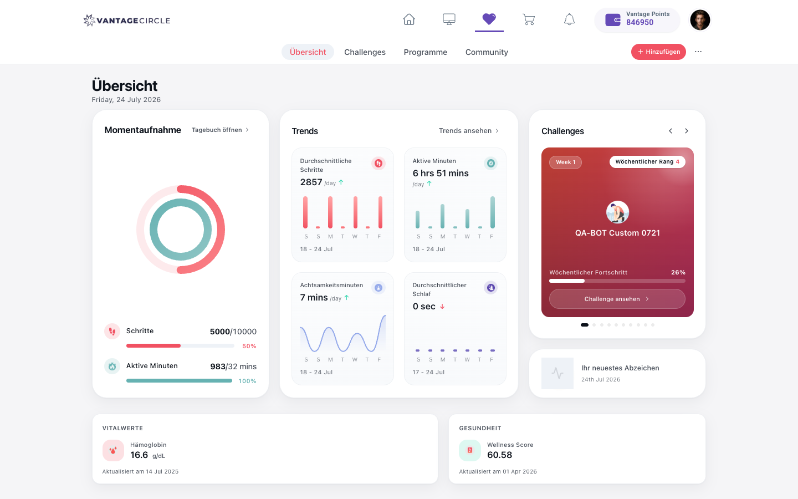
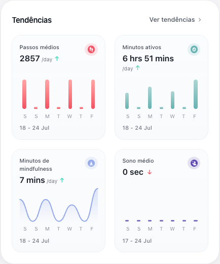

# Vantage Fit Web — Localization Bug Report (consolidated)

**Surface:** Employee Vantage Fit web — `app.vantagecircle.co.in/ng/fit/summary` (heart icon)
**Account / tenant:** `anjan.pathak@… (UAT test account)` — UAT
**Languages tested:** German (de), French (fr), Spanish (es), Portuguese (pt) + English baseline
**Date:** 2026-07-24 · **Module covered so far:** Summary
**How to reproduce any bug below:** Profile avatar → View Profile → My Info → **Edit Profile → Language → Save** (forces logout → re-login via `api.vantagecircle.co.in`) → open `/ng/fit/summary`.
**Screenshots:** `../evidence/summary_de.png`, `summary_fr.png`, `summary_es.png`, `summary_pt.png`, baseline `fit_summary_landing.png`.

---

## 🔧 Assign to FRONTEND developer (top priority first)

| # | Priority | Bug title |
|---|---|---|
| B1 | **P2** | Dates show in English format/text in every language |
| B2 | **P2** | Language-change alert prints a literal `{language}` placeholder (de/fr/es) |
| B3 | **P2** | "Challenges" navigation tab not translated in German |
| B4 | **P2** | "Week 1" (challenge week label) not translated in any language |
| B5 | **P2** | Highlights "Posted by / Likes / Comments / 2 days ago" not translated |
| B6 | P3 | Measurement units (mins / sec / hrs / /day) stay English |
| B7 | P3 | Trend-chart weekday axis "S M T W T F" not localized |
| B8 | P3 | "Active Minutes" label capitalized inconsistently (fr & pt) |
| B9 | P4 | "Wellness Score" stays English (confirm if intentional brand term) |
| B10 | P4 | i18n JSON asset requests return the SPA HTML shell (infra) |

## 🗄️ Assign to BACKEND developer

**None identified in the Summary module.** All backend/data-driven strings behaved correctly across
de/fr/es/pt (they stayed as authored, which is expected): the challenge name "QA-BOT Custom 0721", the
Highlights post title "Q3 Wellness Program — Now Live", and the user name "Anjan Pathak". No server-rendered
string was found mis-localized here. (Re-evaluate per module — backend candidates may appear in Challenges/
Reports-type screens.)

---

# Detailed bugs (top priority first)

## B1 — [P2] Dates display in English format/text in every language
**Type:** Localization / Copy · **Layer:** Frontend
**Where:** Summary — header date, badge date, trend ranges, "Updated on" dates.

**Description & proof:** In de/fr/es/pt the "Updated on…" *prefix* is translated but the date itself is not,
and the main dates stay fully English. Captured on fresh loads:
- Header: **"Friday, 24 July 2026"** — identical in all 4 languages (should be e.g. de "Freitag, 24. Juli 2026").
- Badge: **"24th Jul 2026"** (English ordinal + month) in all 4.
- Trend ranges: **"18 - 24 Jul"**, **"17 - 24 Jul"** in all 4.
- de "Aktualisiert am **14 Jul 2025**", fr "Mis à jour le **14 Jul 2025**", es "Actualizado el **14 Jul 2025**",
  pt "Atualizado em **14 Jul 2025**" — prefix localized, date English.

**Expected:** locale-formatted dates with translated weekday/month names.
**Screenshot (crop):** `../evidence/bug_B1_date_header_pt.png` · full page `../evidence/summary_de.png`.

---

## B2 — [P2] Language-change alert prints literal `{language}` placeholder
**Type:** Localization / Copy · **Layer:** Frontend
**Where:** My Profile → Edit Profile → change Language → Save (confirmation alert).

**Description & proof:** The confirmation alert's translated strings contain an un-interpolated `{language}`
token. Exact captured alert text:
- **de:** "Sie haben Ihre Sprache in **{language}** geändert. Bitte melden Sie sich erneut an, um auf die Website zuzugreifen."
- **fr:** "Vous avez changé votre langue pour **{language}**. Veuillez vous reconnecter pour accéder au site."
- **es:** "Has cambiado tu idioma a **{language}**. Inicia sesión de nuevo para acceder al sitio."
- **pt:** "Você alterou seu idioma para **{language}**. Faça login novamente para acessar o site."
- **en (correct):** "You have changed your language to **German**. Please login again to access the site."
- → confirmed broken in **all four** non-English locales (de/fr/es/pt); only English interpolates.

**Expected:** the chosen language name interpolated, as English already does.
**Root cause (likely):** the translated strings use a placeholder token the interpolation doesn't replace.
**Screenshot:** none — this is a native browser alert (text captured verbatim above as proof).

---

## B3 — [P2] "Challenges" tab not translated in German
**Type:** Localization · **Layer:** Frontend
**Where:** Summary — top navigation tabs.

**Description & proof:** The 4 tabs translate in fr/es/pt but German leaves "Challenges" in English:
| Tab | de | fr | es | pt |
|---|---|---|---|---|
| Challenges | **Challenges** ❌ | Défis ✅ | Retos ✅ | Desafios ✅ |

(Summary/Programs/Community translate fine in all 4.) → German dictionary is missing this tab's entry.
**Expected:** de "Herausforderungen" (or agreed term).
**Screenshot:** `../evidence/summary_de.png` (tab bar shows "Challenges") vs `../evidence/summary_fr.png` ("Défis").

---

## B4 — [P2] "Week 1" not translated in any language
**Type:** Localization · **Layer:** Frontend
**Where:** Summary → Challenges card (week badge).

**Description & proof:** Renders literal **"Week 1"** in de/fr/es/pt (captured in all four string dumps).
**Expected:** de "Woche 1", fr "Semaine 1", es/pt "Semana 1".
**Screenshot (crop):** `../evidence/bug_B4_week1_pt.png` (Challenges card — badge still reads "Week 1" in Portuguese).

---

## B5 — [P2] Highlights social strings not translated
**Type:** Localization · **Layer:** Frontend
**Where:** Summary → Highlights (community post) card.

**Description & proof:** In all 4 languages the card shows English: **"Posted by"**, **"0 Likes"**,
**"0 Comments"**, and relative time **"2 days ago"**. (The post *title* "Q3 Wellness Program — Now Live" is
user/backend data and correctly stays as authored — not a bug.)
**Expected:** translated labels + localized relative time (e.g. de "vor 2 Tagen", "Gepostet von", "Kommentare").
**Screenshot (crop):** `../evidence/bug_B5_highlights_social_pt.png` (post shows "2 days ago / Posted by / Likes / Comments" in English while in Portuguese).

---

## B6 — [P3] Measurement units stay English
**Type:** Localization · **Layer:** Frontend
**Where:** Summary → Snapshot & Trends cards.

**Description & proof:** Unit abbreviations unchanged in all 4: **"6 hrs 51 mins"**, **"7 mins"**, **"0 sec"**,
**"2857 /day"**, **"983/32 mins"**. Units appear concatenated as hardcoded English.
**Expected:** locale-appropriate units.
**Screenshot (crop):** `../evidence/bug_B6_B7_units_axis_pt.png` (Trends card in Portuguese — "6 hrs 51 mins", "/day", and the "S M T W T F" axis all English). Same crop evidences **B7**.

---

## B7 — [P3] Trend-chart weekday axis not localized
**Type:** Localization · **Layer:** Frontend
**Where:** Summary → Trends charts (x-axis).

**Description & proof:** Axis initials render **"S M T W T F"** (English) in all 4 languages.
**Expected:** localized weekday initials (e.g. de "M D M D F S S").
**Screenshot (crop):** `../evidence/bug_B6_B7_units_axis_pt.png` (weekday letters "S M T W T F" under the Trends chart).

---

## B8 — [P3] "Active Minutes" capitalized inconsistently (fr & pt)
**Type:** Localization / UI consistency · **Layer:** Frontend
**Where:** Summary — Snapshot card vs Trends card (same metric).

**Description & proof:** The same label uses different casing in two places:
- fr: **"Minutes Actives"** (Snapshot) vs **"Minutes actives"** (Trends)
- pt: **"Minutos Ativos"** (Snapshot) vs **"Minutos ativos"** (Trends)
**Expected:** one consistent capitalization.
**Screenshot:** `../evidence/summary_fr.png` (compare Snapshot vs Trends card labels).

---

## B9 — [P4] "Wellness Score" stays English (judgment call)
**Type:** Localization / Copy · **Layer:** Frontend
**Where:** Summary → Health card.

**Description & proof:** "Wellness Score" is unchanged in all 4 languages. May be an intentional brand/product
term (like "Vantage Fit"). **Needs product confirmation** whether it should localize.
**Screenshot:** `../evidence/summary_es.png` (Health card: "Wellness Score 60.58").

---

## B10 — [P4] i18n JSON asset requests return the SPA HTML shell
**Type:** Infrastructure · **Layer:** Frontend / build config
**Where:** network — `/ng/assets/i18n/fit/{en,fr,es,pt,pt-BR,pt-PT,de}.json`.

**Description & proof:** The app requests those 7 locale files, but each responds with
`content-type: text/html` (the SPA `index.html`), i.e. `<!DOCTYPE html> <html lang="en" …`, not JSON.
Translations still render (strings are served/bundled elsewhere), so it is **not user-visible** — but the
requests are dead/HTML-fallback and suggest a misconfigured asset path worth cleaning up.
**Proof:** fetch of `/ng/assets/i18n/fit/en.json` → 200, `content-type: text/html`, body begins
`"<!DOCTYPE html> <html lang=\"en\" data-beasties-container>"`.
**Screenshot:** n/a (network/console evidence; recorded in `Execution_Status.md`).
