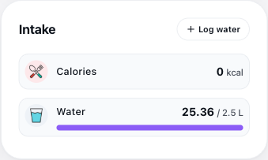
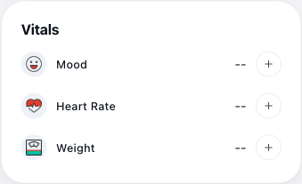
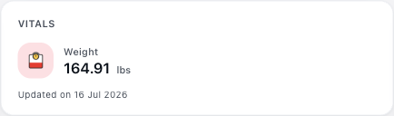
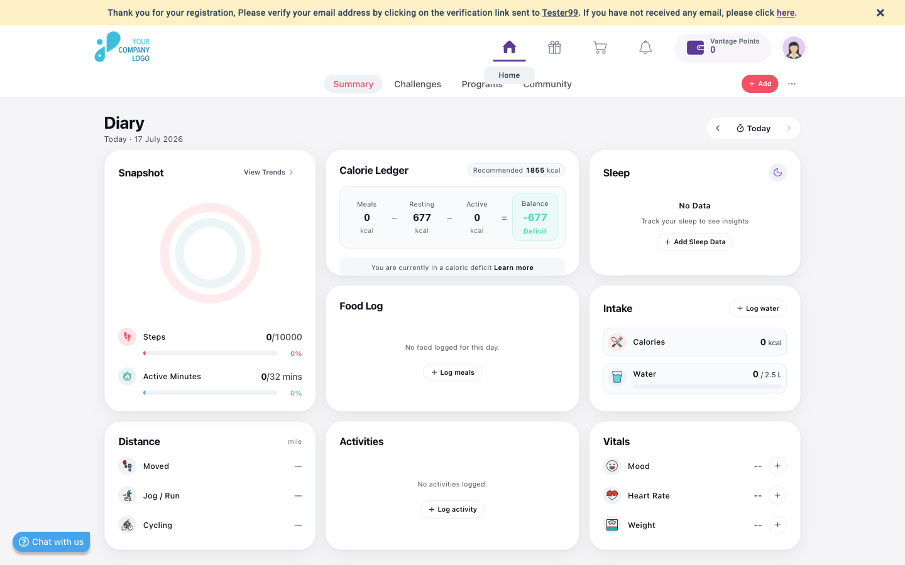

# Vantage Fit Web — Diary Module: P1 Regression Findings

> **This is a shareable snapshot for handoff to development — not part of the permanent QA record.**
> The permanent, ongoing test-case and bug-log files live in `dashboard/diary/test-cases/diary.md`
> and `dashboard/diary/bug-logs/bug-log.md` and are unaffected by this file. This report (and this
> whole `shared-reports/` folder) is disposable — expect it to be deleted once shared.

**Environment:** `fitvantage.vantagecircle.com/ng/fit/summary/diary`
**Test dates:** 16–17 July 2026
**Account:** Demo/test tenant
**Scope:** P1-priority test cases, all 13 sections of the Diary module

**Note on scope:** one originally-suspected issue (Distance card not reflecting a manually-logged
activity) was investigated and retracted after finding the Quick Add menu's own "Start Outdoor
Workout — Track on app" label — the same app-only convention already established for Heart Rate.
That item is not included below, as it is not a defect.

## Summary

| Priority | Count | What it covers |
|---|---|---|
| P2 — High impact | 5 | Broken/missing functionality, real accessibility blockers |
| P3 — Cross-page inconsistency / accessibility | 2 | Confusing but not data-breaking |
| P4 — Low-impact / enhancement | 2 | Minor accessibility polish |
| **Total confirmed findings** | **9** | |

## At a glance

| # | Priority | Issue | Location | Test case ref. |
|---|---|---|---|---|
| BUG-01 | P2 | Water intake shows mismatched units | Intake card | INTAKE-TC-006 |
| BUG-02 | P2 | Water daily goal disagrees between modal and card | Intake card / Log Water modal | INTAKE-TC-005/014 |
| BUG-03 | P2 | Sleep entries cannot be edited once logged | Sleep card | SLEEP-TC-005 |
| BUG-04 | P2 | Activities & Snapshot don't refresh after logging (need a hard reload) | Activities card, Snapshot card | ACT-TC-002, SNAP-TC-004 |
| BUG-05 | P3 | Weight shown inconsistently across Diary, Summary, and the log modal | Vitals card (cross-page) | VIT-TC-007/011 |
| BUG-06 | P2 | No visible keyboard focus indicator anywhere checked | Site-wide (accessibility) | A11Y-TC-007 |
| BUG-07 | P3 | "More" nav button has no accessible name | Header navigation | — (page-level) |
| BUG-08 | P4 | No "Skip to main content" link | Site-wide (accessibility) | A11Y-TC-013 |
| BUG-09 | P4 | Footer heading hierarchy skips a level (H2 → H4) | Page footer | A11Y-TC-002 |

---

## Findings in detail

### BUG-01 — Water intake shows mismatched units `P2`
**Location:** Diary → Intake card (Water row)

**Steps:** Log any water amount via "Log water" (e.g. 3 glasses / 750 ml) → read the Water row.

**Expected:** Numerator and denominator share one consistent unit — e.g. "0.75 / 2.5 L".

**Actual:** Displays "25.36 / 2.5 L" — 25.36 is the fl-oz equivalent of 750 ml, shown against an
"L" suffix with no conversion applied.

*Intake card, 16 July 2026*

---

### BUG-02 — Water daily goal disagrees between modal and card `P2`
**Location:** Diary → Intake card vs. Log Water modal

**Steps:** Open "Log water" and note the stated goal ("2000 ml to goal" from 0) → close and read
the Intake card's Water goal.

**Expected:** Both surfaces state the same daily goal for the same metric.

**Actual:** Modal states 2,000 ml (2 L); Intake card states 2.5 L.

*Intake card's stated goal — compare against the modal's 2,000 ml*

---

### BUG-03 — Sleep entries cannot be edited once logged `P2`
**Location:** Diary → Sleep card

**Steps:** Log a sleep entry via "Add Sleep Data" → click the resulting "X hrs Y mins / Total
sleep duration" text.

**Expected:** An edit affordance appears, matching Weight/Mood's "Edit weight" / "Edit mood"
pattern once logged.

**Actual:** Nothing happens on click — no modal, no edit affordance found anywhere on the card.

---

### BUG-04 — Activities & Snapshot don't refresh after logging `P2`
**Location:** Diary → Activities card, Snapshot card

**Steps:** Log a new activity (Quick Add → Log Activity → Hiking, 30 min, 5.0 km) while on the
Diary page, without reloading.

**Expected:** Both cards update in place immediately — the save is confirmed successful
server-side (`activity/save` → 200).

**Actual:** Activities card still shows "No activities logged" and Snapshot's Active Minutes
stays at 0 until a hard reload; only then do both correctly show the new entry.

*Post-reload state (correct) — the bug is the delay before this point, not this state itself*

---

### BUG-05 — Weight shown inconsistently across pages `P3`
**Location:** Diary Vitals card vs. Summary Vitals card vs. Log Weight modal

**Steps:** On a day with no new weight log, compare Diary's Vitals Weight row, Summary's Vitals
card, and the Log Weight modal's pre-fill.

**Expected:** One consistent representation of "current weight" across all three surfaces.

**Actual:** Diary shows "--" (as if never logged); Summary shows "164.91 lbs · Updated on 16 Jul
2026"; the Log Weight modal also silently pre-fills the last real value. Three different answers
to the same question.

*Diary's Vitals — Weight "--" (17 July)*

*Summary's Vitals — same account, same day*

---

### BUG-06 — No visible keyboard focus indicator `P2`
**Location:** Site-wide — confirmed on 2 separate elements

**Steps:** Load any page → press Tab → observe the focused element's visual state.

**Expected:** A clearly visible focus ring/outline on the focused element.

**Actual:** No visible change. Confirmed via computed style on two separately-focused elements
(Home link, Redeem link): `outline-style: none`, `box-shadow: none`, no border change.

*Home link focused via Tab — no visible ring*

---

### BUG-07 — "More" nav button has no accessible name `P3`
**Location:** Header navigation — overflow "More" trigger

**Steps:** Inspect the DOM for the nav overflow button (`class="more-trigger"`).

**Expected:** A real accessible name, e.g. `aria-label="More"`.

**Actual:** Empty text content, no `aria-label`. A screen-reader user tabbing to it hears only
"button."

---

### BUG-08 — No "Skip to main content" link `P4`
**Location:** Site-wide

**Steps:** Load any page fresh → press Tab once, immediately.

**Expected:** A "Skip to main content" link as the first focusable element.

**Actual:** First Tab stop is the header logo/Home link — no skip-link exists to bypass the
repeated header/nav chrome.

---

### BUG-09 — Footer heading hierarchy skips a level `P4`
**Location:** Page footer

**Steps:** Inspect the DOM heading structure from the footer's tagline down through its link
groups.

**Expected:** Sequential heading levels with no skips (main content correctly does this: H1 → H2
per card).

**Actual:** Footer tagline ("Sweat now, Shine later.") is marked up as H2, followed directly by
H4 ("Powered by Vantage Circle") — H3 is skipped entirely.

---

*Compiled from a live P1-priority regression pass against production, 16–17 July 2026. Full
test-case detail and Actual Result evidence: `dashboard/diary/test-cases/diary.md`,
`dashboard/diary/bug-logs/bug-log.md`.*
